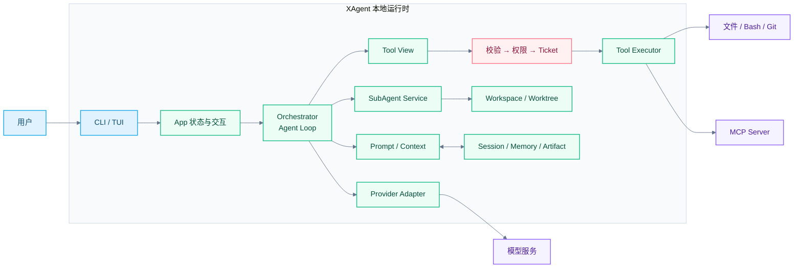
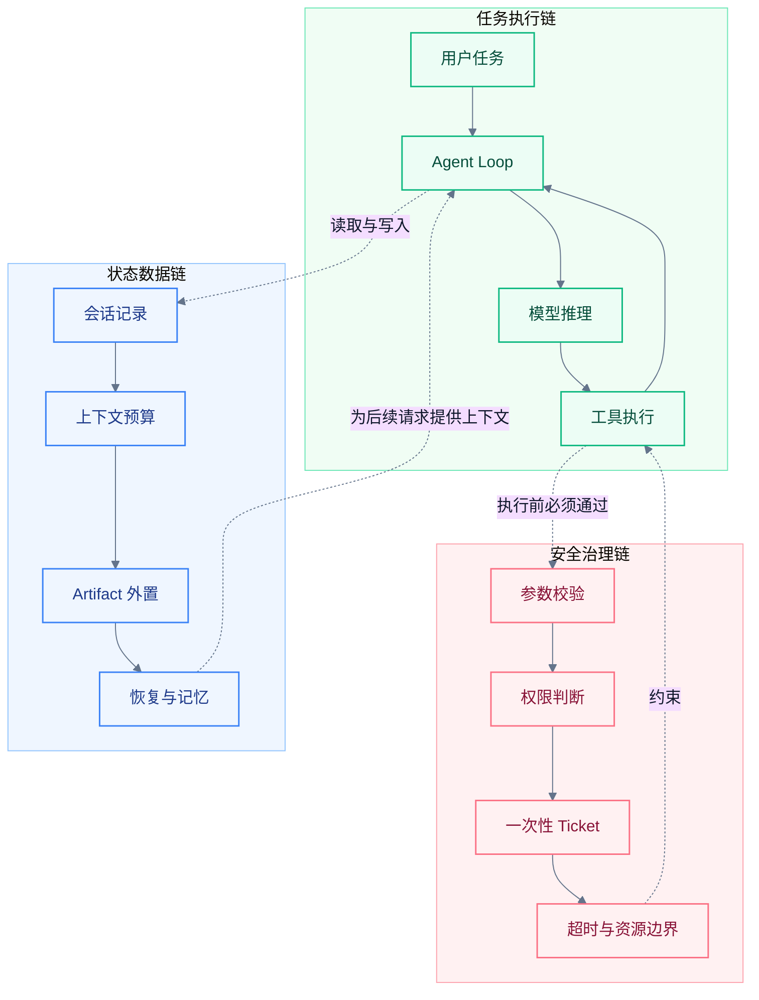
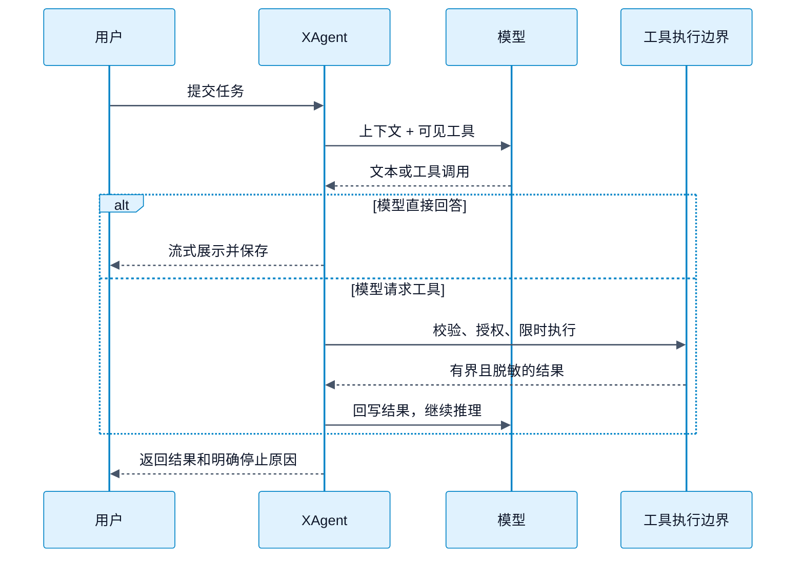
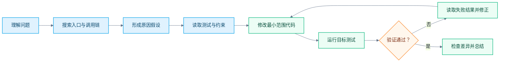
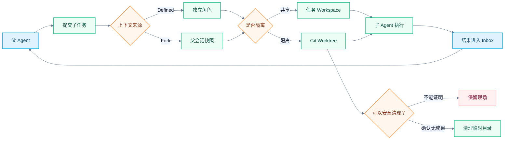
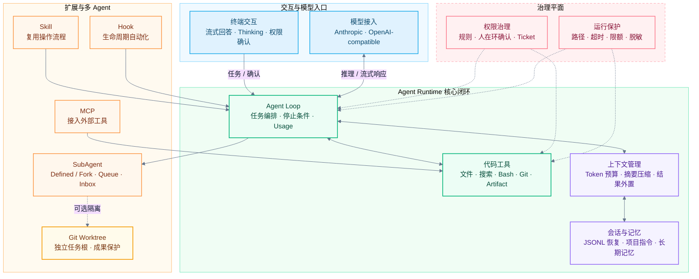

# XAgent 项目技术说明

XAgent 是一个使用 Go 构建的终端 AI 编程助手。它把大模型、代码工具、项目上下文、权限控制、会话恢复和子 Agent 统一到一个本地运行时中。

一句话概括：**模型负责提出意图，XAgent 负责把意图变成受控、可恢复的工程执行。**

## 快速了解

| 读者最关心的问题 | 答案 |
| --- | --- |
| XAgent 是什么？ | 一个运行在本地终端中的 AI 编程 Agent，也是负责模型、工具、权限、上下文和子任务的工程运行时 |
| 它面向谁？ | 需要理解代码、修改项目、执行验证、沉淀流程或拆解复杂任务的研发人员 |
| 用户给它什么？ | 自然语言任务、当前代码仓库，以及项目配置、Skill、Hook、权限规则等上下文 |
| 它能产出什么？ | 代码分析、实施计划、文件修改、命令结果、验证结论、子任务结果和可恢复的会话记录 |
| 它运行在哪里？ | 主程序、工具和数据治理主要运行在本地；模型请求和 MCP 工具可按配置访问外部服务 |
| 它和普通 AI 聊天有什么不同？ | 模型不能直接操作项目，所有副作用都要经过 XAgent 的确定性校验、权限和执行边界 |

从使用者视角看，XAgent 提供一个终端入口；从架构视角看，它是一套 Agent Runtime；从安全视角看，它是模型与真实工程环境之间的治理层。

## 1. 项目定位与价值

大模型能够理解和生成代码，但直接操作真实仓库仍存在不确定性、副作用、上下文丢失和并行冲突。XAgent 在模型与工程环境之间增加一层可治理的 Agent Runtime。

### 1.1 三方职责

| 参与者 | 负责什么 | 不负责什么 |
| --- | --- | --- |
| 用户 | 提出目标、确认高风险操作、判断最终结果 | 不需要手工拼接每次模型请求和工具结果 |
| 大模型 | 理解需求、分析代码、提出计划和工具调用意图 | 不直接持有文件系统、Shell 或 Git 的执行权 |
| XAgent | 组织上下文、暴露可用工具、校验授权、执行操作、保存状态 | 不代替用户作最终业务判断，也不把模型输出视为可信指令 |

这三者形成“用户定目标、模型做推理、运行时控执行”的协作关系。

### 1.2 这个项目做了什么

XAgent 已经把一个可对话的模型客户端扩展为完整的本地 Agent 工程系统：

| 建设内容 | 已完成的能力 | 解决的问题 |
| --- | --- | --- |
| 终端应用 | 流式回答、Thinking、工具状态、权限确认、会话与任务导航 | 让用户在一个入口内观察并控制 Agent |
| Agent Loop | 模型请求、工具调用、结果回写、停止原因和 Usage 结算 | 让模型能够连续完成多步任务，而不是只回答一次 |
| 模型适配 | Anthropic 与 OpenAI-compatible 协议、流式事件和工具 Schema | 隔离不同模型服务的协议差异 |
| 工具执行系统 | 文件、搜索、Bash、Git、Artifact、Schema、Registry 和 Executor | 把模型意图转成可校验、可限时的本地操作 |
| 权限与安全 | 权限规则、人在环确认、一次性 Ticket、路径保护、脱敏和资源上限 | 防止模型绕过确认或产生无界副作用 |
| 上下文与数据 | Token 预算、摘要压缩、JSONL 会话、恢复、指令、记忆和大型结果外置 | 支持长任务以及进程中断后的继续工作 |
| 扩展体系 | Skill、Hook 和 MCP | 复用工作流、响应生命周期事件、接入外部工具 |
| SubAgent | Defined/Fork、角色、队列、事件、取消、后台运行和结果 Inbox | 把复杂任务拆成可管理的独立子任务 |
| Worktree 隔离 | 独立任务根、Git Worktree、租约、恢复、结算和保守清理 | 避免多个 Agent 修改同一工作目录并保护未提交成果 |
| 测试与文档 | 大规模测试、故障场景、真实 Git 边界和模块化设计文档 | 让关键行为可以验证、回归和审查 |

### 1.3 为什么需要这套运行时

| 工程问题 | 平台能力 | 带来的价值 |
| --- | --- | --- |
| 模型输出不确定，可能调用错误工具 | 工具校验、权限确认、一次性执行凭证 | 模型不能直接绕过本地控制 |
| 文件修改和命令执行可能产生副作用 | 最小权限、路径保护、超时和输出上限 | 降低误操作和资源失控风险 |
| 长会话容易超出上下文或中断 | 上下文压缩、Artifact、会话恢复和记忆 | 支持更长、更连续的工程任务 |
| 团队流程和外部能力难复用 | Skill、Hook 和 MCP | 在不修改 Agent Loop 的情况下扩展能力 |
| 复杂任务拆解后容易互相覆盖 | 子 Agent、结果 Inbox 和 Git Worktree | 支持并行处理并保护已有成果 |

XAgent 的主要优势是：**闭环完整、安全边界前置、长任务可恢复、多 Agent 可隔离、扩展机制不侵入核心。**

### 1.4 项目边界

XAgent 不是新的大模型，也不负责训练模型；它负责让现有模型在代码仓库中可靠工作。Worktree 提供工程级目录隔离，但不是对抗同用户恶意进程的操作系统沙箱。系统也不会在没有用户授权的情况下自动完成代码合并、推送或发布。

### 1.5 典型使用场景

| 场景 | 用户通常怎么说 | XAgent 实际完成的工作 | 最终产出 |
| --- | --- | --- | --- |
| 理解陌生项目 | “这个模块是怎么工作的？” | 搜索入口、读取关键实现、追踪调用关系并组织证据 | 代码结构、执行流程和关键文件说明 |
| 定位问题 | “为什么这个请求会失败？” | 检索日志相关代码、分析状态变化、运行只读诊断 | 原因判断、影响范围和验证方法 |
| 修改代码 | “修复这个 Bug，并补充测试” | 制定步骤、编辑文件、执行测试、根据结果继续修正 | 代码改动、测试结果和变更说明 |
| 执行重复流程 | “按团队规范检查这次变更” | 加载 Skill 或项目指令，按固定流程调用工具 | 可重复的检查过程和结构化结论 |
| 拆解复杂任务 | “并行分析四个相互独立的模块” | 创建子任务、分配上下文和能力、汇总结果 | 多个子 Agent 的独立结论与统一摘要 |
| 隔离并行修改 | “让不同子任务分别修改代码” | 为任务绑定独立 Worktree，保留未提交成果 | 互不覆盖的修改现场，供用户审查和集成 |
| 继续中断任务 | “恢复上次会话继续处理” | 校验持久化记录、恢复可信状态和上下文摘要 | 可继续执行的会话，而不是从头重做 |

## 2. 总体架构

### 2.1 六层组成

| 层次 | 负责什么 | 代表模块 |
| --- | --- | --- |
| 交互层 | 输入、流式展示、确认和任务导航 | `app`、`tui` |
| 编排层 | Agent Loop、停止条件和任务运行 | `orchestrator` |
| 能力层 | 模型、工具、Skill、Hook、MCP、SubAgent | `provider`、`tool`、`subagent` |
| 治理层 | 权限、路径、脱敏和资源限制 | `permission`、`safefs`、`redact` |
| 数据层 | 会话、上下文、记忆和大型结果 | `conversation`、`contextmgr`、`artifact` |
| 隔离层 | 按任务根重建能力和管理 Git Worktree | `workspace`、`worktree` |

### 2.2 三条关键链路

为了理解这些模块如何配合，可以把系统看成三条同时工作的链路：

- **任务执行链**让模型能够反复“思考—操作—观察”，直到得到结果或命中停止条件。
- **安全治理链**决定某次操作是否允许以及允许到什么范围，不能被模型输出绕过。
- **状态数据链**控制哪些信息进入模型上下文，并保存能够安全恢复的工程状态。

## 3. Agent 是怎么工作的

### 3.1 一次请求的完整闭环

Agent Loop 只负责连接“模型推理—工具执行—结果回写”。达到完成、错误、取消、权限拒绝或资源上限时，循环会明确停止。

具体来说，一轮任务会经过下面几个阶段：

| 阶段 | XAgent 做什么 | 为什么需要 |
| --- | --- | --- |
| 1. 准备任务 | 绑定当前项目根、会话、运行模式、Skill 和可用工具 | 避免把其他项目或角色的能力带入本次任务 |
| 2. 组织上下文 | 组合系统提示、用户请求、历史消息、项目指令和子任务结果 | 给模型足够信息，同时遵守 Token 与字节预算 |
| 3. 请求模型 | 通过 Provider Adapter 发起流式请求并统一文本、Thinking、Usage 和工具调用事件 | 屏蔽不同模型协议的差异 |
| 4. 判断响应 | 文本直接展示；工具调用进入 Schema、Registry、能力和权限检查 | 模型的工具调用只是请求，不是执行命令 |
| 5. 有界执行 | 在项目根和权限范围内执行工具，并施加超时、取消、输出和进程边界 | 控制文件、Shell、Git 等真实副作用 |
| 6. 结果回写 | 将结构化、脱敏、必要时外置的工具结果返回模型 | 让模型根据真实执行结果继续判断，而不是猜测 |
| 7. 结束或继续 | 模型完成则保存结果；仍需操作则进入下一轮；异常则记录明确停止原因 | 使任务行为可观察、可恢复、可诊断 |

### 3.2 一个代码修复任务如何完成

下面以“定位并修复一个 Bug”为例。XAgent 不会一次生成答案后直接结束，而是围绕真实仓库形成证据闭环：

这里真正执行搜索、编辑和测试的是受控工具；模型负责决定下一步，XAgent 负责保证每一步只在当前任务允许的边界内发生。用户可以看到过程、拒绝高风险操作，也可以随时取消。

### 3.3 复杂任务如何拆解

后台子 Agent 的结果不会偷偷触发新的父模型轮次，而是在下一个安全请求边界进入父上下文。使用 Worktree 时，无法证明可以安全删除就保留现场。

两种子 Agent 上下文模式解决不同问题：

| 模式 | 子 Agent 获得的上下文 | 适合什么任务 | 主要特点 |
| --- | --- | --- | --- |
| Defined | 预先定义的角色、指令、模型和工具范围 | 固定职责，如测试分析、代码审阅 | 输入稳定、能力清晰、便于重复使用 |
| Fork | 父任务在安全边界形成的上下文快照 | 与当前讨论紧密相关的临时分析 | 减少重复说明，但仍重新计算工具和权限边界 |

子 Agent 还可以选择两种工作目录策略：共享 Workspace 适合只读分析或明确不会冲突的任务；Git Worktree 适合需要独立修改代码的任务。隔离任务的成果不会自动 merge、commit 或 push，最终仍由用户决定如何集成。

## 4. 功能组成

绿色区域构成 Agent 的主运行闭环；红色治理平面对模型、工具和资源施加约束；橙色区域负责流程扩展与复杂任务拆解。所有扩展最终仍进入同一 Agent Loop 和工具执行边界，不能自行提高本地权限。

### 4.1 用户能够直接使用的能力

| 功能域 | 系统提供的能力 | 用户能够感知到的效果 |
| --- | --- | --- |
| 终端交互 | 流式文本、Thinking 状态、工具进度、权限确认、取消和任务切换 | 能看到 Agent 正在做什么，并在关键操作前作决定 |
| 代码工具 | 文件读取与编辑、文本搜索、Bash、Git 和结构化 Artifact | Agent 能基于真实代码执行分析、修改和验证 |
| 多模型接入 | Anthropic 与 OpenAI-compatible Provider Adapter | 上层 Agent Loop 不依赖单一模型协议 |
| 上下文管理 | 请求预算、历史压缩、工具结果外置和稳定提示准备 | 长会话不会简单地把所有历史无限塞给模型 |
| 会话与记忆 | JSONL 持久化、记录校验、会话恢复、项目指令和长期记忆 | 中断后可以继续，并保留对项目有价值的信息 |
| 权限治理 | 规则匹配、人在环确认、一次性 Ticket 和能力收窄 | 高风险工具不能仅凭模型一句话直接执行 |
| Skill | 按需加载可复用说明、脚本、模板和资源 | 团队流程可以被反复调用，不必每次重新描述 |
| Hook | 在系统、会话、轮次、消息、工具和压缩等事件上运行自动化 | 统一执行审计、记录或项目级约束 |
| MCP | 发现、连接并调用外部 MCP Server 提供的工具 | 在统一工具边界内使用外部系统能力 |
| SubAgent | 子任务提交、排队、并发、取消、事件和结果 Inbox | 复杂任务可以拆分，但父任务仍能统一收口 |
| Workspace / Worktree | 按任务重建工具、路径、Hook 和数据根；可选 Git 隔离 | 子任务不会天然继承所有能力，并可避免并行写冲突 |

### 4.2 四种扩展方式如何选择

| 需要解决的问题 | 选择 | 原因 |
| --- | --- | --- |
| 复用一套可由 Agent 阅读和执行的工作方法 | Skill | 适合封装说明、脚本、模板和渐进式上下文 |
| 在固定生命周期节点自动检查或记录 | Hook | 不依赖模型主动想起，适合确定性的横切流程 |
| 连接数据库、平台或其他外部系统工具 | MCP | 使用标准协议把外部能力纳入工具目录和权限边界 |
| 把复杂目标拆给独立执行单元 | SubAgent | 每个任务有自己的上下文、状态、能力和完成结果 |

这些机制彼此可以组合。例如，一个子 Agent 可以在独立 Worktree 中工作，加载特定 Skill，通过 MCP 查询外部信息，并仍然接受 Hook 和权限系统约束。

## 5. 如何保证 Agent 可靠、避免出错

可靠性不依赖模型“自觉”，而是依靠多层确定性防线：

| 防错机制 | 主要防止的问题 |
| --- | --- |
| 规格、计划、任务和验收清单 | 需求不清、边界遗漏、实现偏离目标 |
| Schema、Registry、Permission、Ticket | 伪造工具、参数漂移、绕过确认 |
| Workspace 最小能力 | 子 Agent 获得超出角色的工具 |
| 状态机、锁和一次性结算 | 重复完成、取消竞态、重复清理 |
| `safefs` 和 Worktree 身份记录 | 路径逃逸、符号链接风险、误删目录 |
| 超时、队列和输出上限 | 死循环、工具卡死、资源无限增长 |
| JSONL 恢复和 Artifact | 中断后数据丢失、上下文被大结果占满 |
| SafeText、SafeError 和诊断 | 敏感信息泄漏或错误无法定位 |
| 保守结算 | 状态不确定时误删用户成果 |

### 5.1 常见异常如何处理

| 异常场景 | 系统处理方式 | 可靠性目标 |
| --- | --- | --- |
| 模型请求不存在的工具或参数不合法 | 在执行前拒绝，并把结构化错误返回 Agent Loop | 不让无效意图变成真实副作用 |
| 工具需要更高权限 | 根据规则请求用户确认；拒绝后以明确状态结束或继续 | 用户保留高风险操作的决定权 |
| 工具执行超时或任务被取消 | 传播取消信号、约束子进程，并记录停止原因 | 避免后台任务失控或状态假完成 |
| 工具输出过大 | 截断展示或外置到 Artifact，只把有界内容送入模型 | 避免界面、会话和上下文被单次结果撑满 |
| 会话尾部损坏或写入中断 | 校验记录，只恢复可信前缀，不把损坏数据当成历史 | 在可恢复与不伪造状态之间取安全边界 |
| 子 Agent 重复完成、超时与取消竞争 | 通过状态机和一次性结算只接受一个终态 | 防止重复通知、重复释放或状态回退 |
| Worktree 中存在未提交或未知成果 | 不自动删除，保留目录和诊断信息 | 清理失败最多留下现场，不应误删成果 |
| 敏感信息出现在错误或工具结果中 | 在持久化和展示边界使用安全文本与脱敏错误 | 降低凭证进入日志、会话或模型上下文的风险 |

### 5.2 测试保障

项目同时使用单元测试、模块集成、并发与故障测试、真实 Git 场景和平台差异测试。代码规模和主要覆盖方向见附录 A，完整说明见 [测试与可靠性保障](./testing-reliability.md)。

### 5.3 信任边界

- 模型、MCP metadata、工具参数、文件路径和持久化内容默认不可信。
- Hook 是受信自动化，会从固定路径加载且不逐次确认；打开不可信项目之前必须审查。
- `tool_before allow` 不能代替后续 Permission 和 Ticket。
- Worktree 是工程隔离，不是操作系统沙箱。
- 无法证明清理安全时，系统优先保留现场和用户成果。

## 附录 A：代码规模

统计范围为当前工作区 `cmd/` 和 `internal/` 下的 Go 文件，只计算包含 Go 语法 token 的行，排除纯注释行和空白行：

| 代码类型 | 文件数 | 有效代码行数 |
| --- | ---: | ---: |
| 生产代码 | 371 | **80,560** |
| 测试代码 | 313 | **90,850** |
| 合计 | 684 | **171,410** |

测试代码约为生产代码的 **1.13 倍**，占核心 Go 有效代码的 **53.0%**。同一行同时包含代码和注释时仍计为代码，多行字符串中的非空内容按代码数据计入；代码行数不等同于测试覆盖率。

测试主要覆盖 **Agent 核心、工具与安全、状态与恢复、协议与扩展、多 Agent 隔离、装配与终端体验** 六个方面，并重点验证超时、取消、损坏输入、并发竞态、资源上限和清理失败等异常路径。详细设计、代表性测试和场景矩阵见 [测试与可靠性保障](./testing-reliability.md)。

## 附录 B：相关设计资料

完整目录：[XAgent / docs](https://github.com/gugugu5331/XAgent/tree/main/docs)

### 核心运行机制

- [Agent Loop](https://github.com/gugugu5331/XAgent/blob/main/docs/agent-loop/spec.md)
- [System Prompt](https://github.com/gugugu5331/XAgent/blob/main/docs/system-prompt/spec.md)
- [Tool System](https://github.com/gugugu5331/XAgent/blob/main/docs/tool-system/spec.md)
- [Permission System](https://github.com/gugugu5331/XAgent/blob/main/docs/permission-system/spec.md)
- [Context Management](https://github.com/gugugu5331/XAgent/blob/main/docs/context-management/spec.md)
- [Command System](https://github.com/gugugu5331/XAgent/blob/main/docs/command-system/spec.md)

### 扩展与多 Agent

- [Skill System](https://github.com/gugugu5331/XAgent/blob/main/docs/skill-system/spec.md)
- [Hook System](https://github.com/gugugu5331/XAgent/blob/main/docs/hook-system/spec.md)
- [MCP Client](https://github.com/gugugu5331/XAgent/blob/main/docs/mcp-client/spec.md)
- [SubAgent System](https://github.com/gugugu5331/XAgent/blob/main/docs/subagent-system/spec.md)

### 可靠性与演进

- [安全、可靠性与交付质量](https://github.com/gugugu5331/XAgent/blob/main/docs/security-reliability-delivery-quality-2026-07-30/spec.md)
- [会话恢复与长期记忆](https://github.com/gugugu5331/XAgent/blob/main/docs/session-memory-restore/spec.md)
- [可用性与可靠性路线图](https://github.com/gugugu5331/XAgent/blob/main/docs/usability-reliability-roadmap/spec.md)
