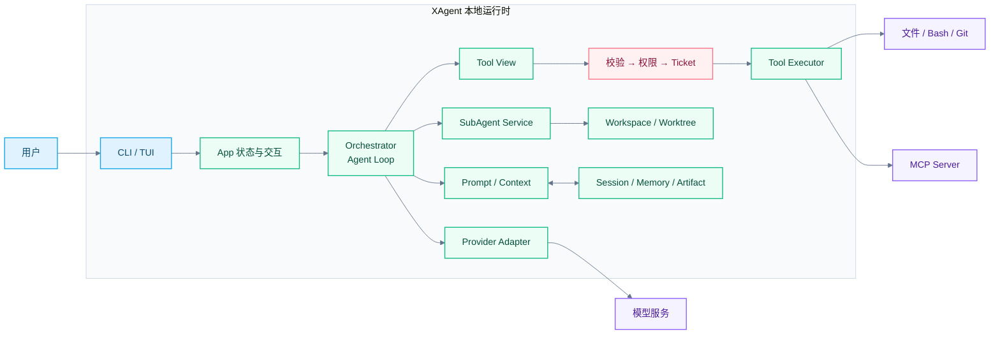
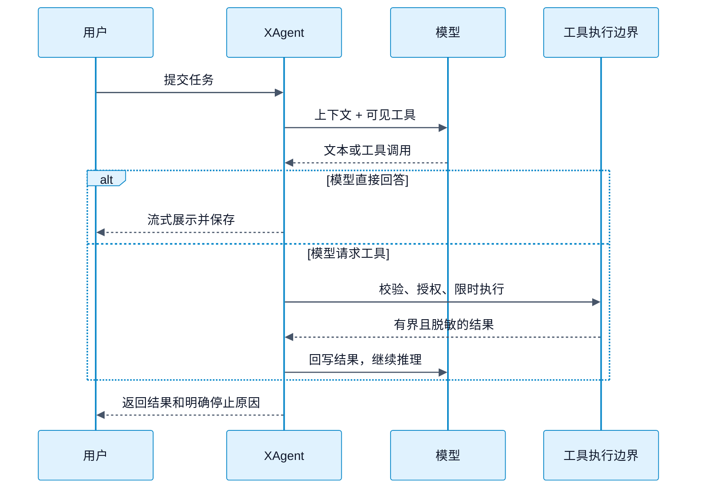
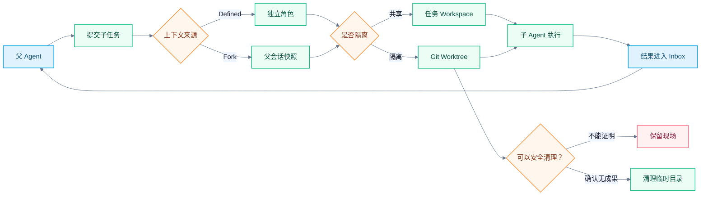
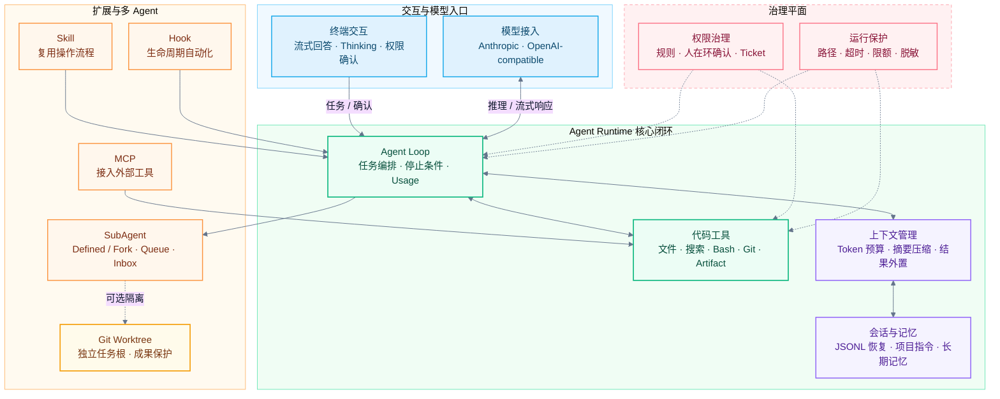

# XAgent 项目技术说明

> 用途：项目介绍、技术评审、新成员入门
>
> 基线：`codex/subagent-system`，HEAD `5418d4680ae88da76a33f2daac07f910b23bb060`
>
> 更新时间：2026-08-16（Asia/Shanghai）

XAgent 是一个使用 Go 构建的终端 AI 编程助手。它把大模型、代码工具、项目上下文、权限控制、会话恢复和子 Agent 统一到一个本地运行时中。

一句话概括：**模型负责提出意图，XAgent 负责把意图变成受控、可恢复的工程执行。**

可单独打开用于评审展示的深色图：[XAgent 架构总览](./xagent-architecture.html)。

## 1. 项目定位与价值

大模型能够理解和生成代码，但直接操作真实仓库仍存在不确定性、副作用、上下文丢失和并行冲突。XAgent 在模型与工程环境之间增加一层可治理的 Agent Runtime。

| 工程问题 | 平台能力 | 带来的价值 |
| --- | --- | --- |
| 模型输出不确定，可能调用错误工具 | 工具校验、权限确认、一次性执行凭证 | 模型不能直接绕过本地控制 |
| 文件修改和命令执行可能产生副作用 | 最小权限、路径保护、超时和输出上限 | 降低误操作和资源失控风险 |
| 长会话容易超出上下文或中断 | 上下文压缩、Artifact、会话恢复和记忆 | 支持更长、更连续的工程任务 |
| 团队流程和外部能力难复用 | Skill、Hook 和 MCP | 在不修改 Agent Loop 的情况下扩展能力 |
| 复杂任务拆解后容易互相覆盖 | 子 Agent、结果 Inbox 和 Git Worktree | 支持并行处理并保护已有成果 |

XAgent 的主要优势是：**闭环完整、安全边界前置、长任务可恢复、多 Agent 可隔离、扩展机制不侵入核心。**

## 2. 总体架构

### 2.1 六层组成

| 层次 | 负责什么 | 代表模块 |
| --- | --- | --- |
| 交互层 | 输入、流式展示、确认和任务导航 | `app`、`tui` |
| 编排层 | Agent Loop、停止条件和任务运行 | `orchestrator` |
| 能力层 | 模型、工具、Skill、Hook、MCP、SubAgent | `provider`、`tool`、`subagent` |
| 治理层 | 权限、路径、脱敏和资源限制 | `permission`、`safefs`、`redact` |
| 数据层 | 会话、上下文、记忆和大型结果 | `conversation`、`contextmgr`、`artifact` |
| 隔离层 | 按任务根重建能力和管理 Git Worktree | `workspace`、`worktree` |

## 3. Agent 是怎么工作的

### 3.1 一次请求的完整闭环

Agent Loop 只负责连接“模型推理—工具执行—结果回写”。达到完成、错误、取消、权限拒绝或资源上限时，循环会明确停止。

### 3.2 复杂任务如何拆解

后台子 Agent 的结果不会偷偷触发新的父模型轮次，而是在下一个安全请求边界进入父上下文。使用 Worktree 时，无法证明可以安全删除就保留现场。

## 4. 功能组成

绿色区域构成 Agent 的主运行闭环；红色治理平面对模型、工具和资源施加约束；橙色区域负责流程扩展与复杂任务拆解。所有扩展最终仍进入同一 Agent Loop 和工具执行边界，不能自行提高本地权限。

## 5. 如何保证 Agent 可靠、避免出错

可靠性不依赖模型“自觉”，而是依靠多层确定性防线：

| 防错机制 | 主要防止的问题 |
| --- | --- |
| 规格、计划、任务和验收清单 | 需求不清、边界遗漏、实现偏离目标 |
| Schema、Registry、Permission、Ticket | 伪造工具、参数漂移、绕过确认 |
| Workspace 最小能力 | 子 Agent 获得超出角色的工具 |
| 状态机、锁和一次性结算 | 重复完成、取消竞态、重复清理 |
| `safefs` 和 Worktree 身份记录 | 路径逃逸、符号链接风险、误删目录 |
| 超时、队列和输出上限 | 死循环、工具卡死、资源无限增长 |
| JSONL 恢复和 Artifact | 中断后数据丢失、上下文被大结果占满 |
| SafeText、SafeError 和诊断 | 敏感信息泄漏或错误无法定位 |
| 保守结算 | 状态不确定时误删用户成果 |

### 5.1 测试保障

项目同时使用单元测试、模块集成、并发与故障测试、真实 Git 场景和平台差异测试。代码规模和主要覆盖方向见附录 A，完整说明见 [测试与可靠性保障](./testing-reliability.md)。

### 5.2 信任边界

- 模型、MCP metadata、工具参数、文件路径和持久化内容默认不可信。
- Hook 是受信自动化，会从固定路径加载且不逐次确认；打开不可信项目之前必须审查。
- `tool_before allow` 不能代替后续 Permission 和 Ticket。
- Worktree 是工程隔离，不是操作系统沙箱。
- 无法证明清理安全时，系统优先保留现场和用户成果。

## 附录 A：代码规模

统计范围为当前工作区 `cmd/` 和 `internal/` 下的 Go 文件，只计算包含 Go 语法 token 的行，排除纯注释行和空白行：

| 代码类型 | 文件数 | 有效代码行数 |
| --- | ---: | ---: |
| 生产代码 | 371 | **80,560** |
| 测试代码 | 313 | **90,850** |
| 合计 | 684 | **171,410** |

测试代码约为生产代码的 **1.13 倍**，占核心 Go 有效代码的 **53.0%**。同一行同时包含代码和注释时仍计为代码，多行字符串中的非空内容按代码数据计入；代码行数不等同于测试覆盖率。

测试主要覆盖 **Agent 核心、工具与安全、状态与恢复、协议与扩展、多 Agent 隔离、装配与终端体验** 六个方面，并重点验证超时、取消、损坏输入、并发竞态、资源上限和清理失败等异常路径。详细设计、代表性测试和场景矩阵见 [测试与可靠性保障](./testing-reliability.md)。

## 附录 B：相关设计资料

完整目录：[XAgent / docs](https://github.com/gugugu5331/XAgent/tree/main/docs)

### 核心运行机制

- [Agent Loop](https://github.com/gugugu5331/XAgent/blob/main/docs/agent-loop/spec.md)
- [System Prompt](https://github.com/gugugu5331/XAgent/blob/main/docs/system-prompt/spec.md)
- [Tool System](https://github.com/gugugu5331/XAgent/blob/main/docs/tool-system/spec.md)
- [Permission System](https://github.com/gugugu5331/XAgent/blob/main/docs/permission-system/spec.md)
- [Context Management](https://github.com/gugugu5331/XAgent/blob/main/docs/context-management/spec.md)
- [Command System](https://github.com/gugugu5331/XAgent/blob/main/docs/command-system/spec.md)

### 扩展与多 Agent

- [Skill System](https://github.com/gugugu5331/XAgent/blob/main/docs/skill-system/spec.md)
- [Hook System](https://github.com/gugugu5331/XAgent/blob/main/docs/hook-system/spec.md)
- [MCP Client](https://github.com/gugugu5331/XAgent/blob/main/docs/mcp-client/spec.md)
- [SubAgent System](https://github.com/gugugu5331/XAgent/blob/main/docs/subagent-system/spec.md)

### 可靠性与演进

- [安全、可靠性与交付质量](https://github.com/gugugu5331/XAgent/blob/main/docs/security-reliability-delivery-quality-2026-07-30/spec.md)
- [会话恢复与长期记忆](https://github.com/gugugu5331/XAgent/blob/main/docs/session-memory-restore/spec.md)
- [可用性与可靠性路线图](https://github.com/gugugu5331/XAgent/blob/main/docs/usability-reliability-roadmap/spec.md)
