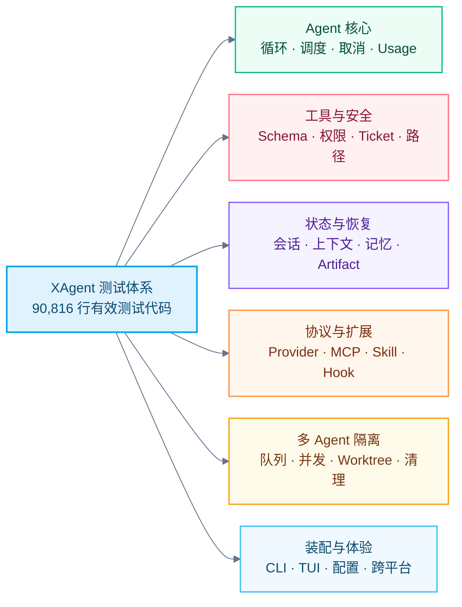

# XAgent 测试与可靠性保障

> 适用范围：`cmd/` 与 `internal/` 下的 Go 生产代码和测试代码
>
> 统计快照：2026-08-17，分支 `codex/subagent-system`

## 1. 文档目的

本文说明 XAgent 如何通过测试验证 Agent Runtime 的核心行为、安全边界、故障恢复和多 Agent 隔离。

这里的“覆盖”表示仓库中存在对应测试代码和场景，不表示某个运行时覆盖率百分比。测试代码规模不能单独证明系统不会出错，可靠性仍依赖架构约束、确定性执行边界和持续验证。

## 2. 测试规模

只计算包含 Go 语法 token 的行，排除纯注释行和空白行：

| 代码类型 | 文件数 | 有效代码行数 |
| --- | ---: | ---: |
| 生产代码 | 371 | 80,560 |
| 测试代码 | 312 | 90,816 |
| 合计 | 683 | 171,376 |

测试代码约为生产代码的 1.13 倍，占核心 Go 有效代码的 53.0%。测试侧包含 1,583 个普通 `Test*` 入口、1 个 Fuzz 入口和 1 个 `TestMain` 包级入口。

统计规则：

- 纯注释行和空白行不计入；
- 代码与注释同处一行时计为代码；
- 字符串中的 `//`、`/* */` 不视为注释；
- 多行字符串中的非空内容按代码数据计入；
- `*_test.go` 计为测试代码，其他 `.go` 文件计为生产代码。

## 3. 覆盖全景

## 4. 六类测试覆盖

### 4.1 Agent 核心

主要验证模型请求到工具结果回写的完整循环：

- Provider 流式事件如何转换为文本、Thinking 和工具调用；
- 多工具调度、可并发执行与确定顺序提交；
- 正常完成、模型错误、工具错误、取消和资源上限等停止原因；
- Usage、缓存使用量和最终状态只结算一次；
- 子 Agent 结果如何投影并回流父 Agent。

代表性测试：

- [`internal/orchestrator/chat_test.go`](https://github.com/gugugu5331/XAgent/blob/main/internal/orchestrator/chat_test.go)
- [`internal/orchestrator/tool_scheduler_test.go`](https://github.com/gugugu5331/XAgent/blob/main/internal/orchestrator/tool_scheduler_test.go)
- [`internal/orchestrator/ordered_commit_test.go`](https://github.com/gugugu5331/XAgent/blob/main/internal/orchestrator/ordered_commit_test.go)
- [`internal/orchestrator/cancellation_test.go`](https://github.com/gugugu5331/XAgent/blob/main/internal/orchestrator/cancellation_test.go)
- [`internal/orchestrator/usage_commit_test.go`](https://github.com/gugugu5331/XAgent/blob/main/internal/orchestrator/usage_commit_test.go)

### 4.2 工具与安全边界

主要验证模型意图不能直接变成无约束副作用：

- 工具名、参数和 Schema 校验；
- Registry/View 只暴露当前 Workspace 可用能力；
- Permission、人在环确认和一次性 Ticket；
- 文件根目录、符号链接、路径穿越和工作区绑定；
- Bash 超时、输出上限、捕获和结果工厂；
- SafeText、SafeError 和秘密 canary 不进入公共输出。

代表性测试：

- [`internal/tool/scoped_executor_test.go`](https://github.com/gugugu5331/XAgent/blob/main/internal/tool/scoped_executor_test.go)
- [`internal/tool/workspace_policy_test.go`](https://github.com/gugugu5331/XAgent/blob/main/internal/tool/workspace_policy_test.go)
- [`internal/permission/ticket_test.go`](https://github.com/gugugu5331/XAgent/blob/main/internal/permission/ticket_test.go)
- [`internal/safefs/protection_test.go`](https://github.com/gugugu5331/XAgent/blob/main/internal/safefs/protection_test.go)
- [`internal/redact/runtime_test.go`](https://github.com/gugugu5331/XAgent/blob/main/internal/redact/runtime_test.go)

### 4.3 状态、上下文与恢复

主要验证长任务和进程中断后的数据连续性：

- JSONL 记录校验、损坏尾部恢复和可信前缀；
- 会话格式迁移、状态摘要和存储切换；
- Token 预算、自动压缩、摘要失败和子 Agent 预留；
- 项目指令 Include、Workspace 切换和路径边界；
- 用户/项目记忆隔离以及 Artifact 私有存储。

代表性测试：

- [`internal/conversation/jsonl_store_test.go`](https://github.com/gugugu5331/XAgent/blob/main/internal/conversation/jsonl_store_test.go)
- [`internal/conversation/recovery_test.go`](https://github.com/gugugu5331/XAgent/blob/main/internal/conversation/recovery_test.go)
- [`internal/conversation/migration_test.go`](https://github.com/gugugu5331/XAgent/blob/main/internal/conversation/migration_test.go)
- [`internal/contextmgr/request_budgeter_test.go`](https://github.com/gugugu5331/XAgent/blob/main/internal/contextmgr/request_budgeter_test.go)
- [`internal/instructions/include_test.go`](https://github.com/gugugu5331/XAgent/blob/main/internal/instructions/include_test.go)
- [`internal/artifact/file_store_test.go`](https://github.com/gugugu5331/XAgent/blob/main/internal/artifact/file_store_test.go)

### 4.4 模型协议与扩展能力

主要验证外部协议和自动化机制不能破坏本地边界：

- Anthropic 与 OpenAI-compatible 请求、工具 Schema 和流式响应；
- SSE 解码、流生命周期、响应上限和秘密脱敏；
- MCP initialize、JSON-RPC、分页发现、stdio/HTTP Transport 和生命周期；
- Skill 发现、解析、历史策略和 Workspace 快照；
- Hook 条件、Command/HTTP/Prompt 动作、超时、once 和诊断。

代表性测试：

- [`internal/provider/anthropic_stream_test.go`](https://github.com/gugugu5331/XAgent/blob/main/internal/provider/anthropic_stream_test.go)
- [`internal/provider/openai_stream_test.go`](https://github.com/gugugu5331/XAgent/blob/main/internal/provider/openai_stream_test.go)
- [`internal/provider/sse_decoder_test.go`](https://github.com/gugugu5331/XAgent/blob/main/internal/provider/sse_decoder_test.go)
- [`internal/mcpclient/protocol/codec_test.go`](https://github.com/gugugu5331/XAgent/blob/main/internal/mcpclient/protocol/codec_test.go)
- [`internal/mcpclient/manager_lifecycle_test.go`](https://github.com/gugugu5331/XAgent/blob/main/internal/mcpclient/manager_lifecycle_test.go)
- [`internal/hook/hard_boundary_test.go`](https://github.com/gugugu5331/XAgent/blob/main/internal/hook/hard_boundary_test.go)
- [`internal/skill/manager_test.go`](https://github.com/gugugu5331/XAgent/blob/main/internal/skill/manager_test.go)

### 4.5 SubAgent、Workspace 与 Worktree

主要验证复杂任务的并发、隔离和成果保护：

- Defined/Fork 输入、角色约束和上下文快照；
- 并发上限、FIFO 队列、前后台切换、取消和超时；
- 任务 Admission、一次性 Settlement、事件 Gap/Watermark 和结果 Inbox；
- 按任务根重新绑定工具、Prompt、Hook、Memory 和 Artifact；
- 真实 Git Worktree 创建、初始化、租约、恢复、结算和 Janitor；
- dirty、untracked、冲突或未推送 Commit 存在时保留现场；
- 并发锁、身份替换、损坏 Record 和 Fuzz 输入。

代表性测试：

- [`internal/subagent/manager_test.go`](https://github.com/gugugu5331/XAgent/blob/main/internal/subagent/manager_test.go)
- [`internal/subagent/manager_admission_settlement_test.go`](https://github.com/gugugu5331/XAgent/blob/main/internal/subagent/manager_admission_settlement_test.go)
- [`internal/subagent/result_inbox_test.go`](https://github.com/gugugu5331/XAgent/blob/main/internal/subagent/result_inbox_test.go)
- [`internal/workspace/protection_test.go`](https://github.com/gugugu5331/XAgent/blob/main/internal/workspace/protection_test.go)
- [`internal/worktree/manager_integration_test.go`](https://github.com/gugugu5331/XAgent/blob/main/internal/worktree/manager_integration_test.go)
- [`internal/worktree/recovery_settlement_integration_test.go`](https://github.com/gugugu5331/XAgent/blob/main/internal/worktree/recovery_settlement_integration_test.go)
- [`internal/worktree/concurrency_test.go`](https://github.com/gugugu5331/XAgent/blob/main/internal/worktree/concurrency_test.go)
- [`internal/worktree/janitor_test.go`](https://github.com/gugugu5331/XAgent/blob/main/internal/worktree/janitor_test.go)

### 4.6 Assembly、CLI/TUI 与平台差异

主要验证所有能力在生产入口中只有一套装配和关闭路径：

- Assembly 依赖接线、失败回滚和逆序关闭；
- Worktree 能力不可用时只降级隔离模式，不破坏共享任务；
- CLI 参数、启动状态和生命周期；
- App 到 TUI 的安全状态投影、任务导航和事件订阅；
- Darwin/Linux/Windows 下的文件、进程和 Worktree 能力差异。

代表性测试：

- [`cmd/xagent/assembly_test.go`](https://github.com/gugugu5331/XAgent/blob/main/cmd/xagent/assembly_test.go)
- [`cmd/xagent/assembly_worktree_unavailable_test.go`](https://github.com/gugugu5331/XAgent/blob/main/cmd/xagent/assembly_worktree_unavailable_test.go)
- [`cmd/xagent/worktree_e2e_test.go`](https://github.com/gugugu5331/XAgent/blob/main/cmd/xagent/worktree_e2e_test.go)
- [`internal/app/lifecycle_test.go`](https://github.com/gugugu5331/XAgent/blob/main/internal/app/lifecycle_test.go)
- [`internal/app/task_events_test.go`](https://github.com/gugugu5331/XAgent/blob/main/internal/app/task_events_test.go)
- [`internal/tui/view_model_test.go`](https://github.com/gugugu5331/XAgent/blob/main/internal/tui/view_model_test.go)
- [`internal/safefs/root_windows_test.go`](https://github.com/gugugu5331/XAgent/blob/main/internal/safefs/root_windows_test.go)

## 5. 异常场景矩阵

| 风险类型 | 重点测试场景 | 预期保障 |
| --- | --- | --- |
| 模型或工具卡住 | 超时、取消、流中断、关闭竞态 | 任务有界停止，资源被收束 |
| 输入损坏或不可信 | 非法 Schema、JSONL 尾损坏、恶意路径、异常 MCP 数据 | 拒绝、恢复可信前缀或输出安全诊断 |
| 并发竞态 | 重复完成、取消与完成竞争、双 Janitor、队列压力 | 终态和副作用只结算一次 |
| 资源耗尽 | 输出、Token、队列、事件、Inbox、响应大小达到上限 | 返回明确的有界结果，不继续无限增长 |
| 初始化失败 | Provider/MCP/Hook/Workspace/Worktree 中途失败 | 回滚已创建资源，保留可诊断状态 |
| 敏感信息泄漏 | 路径、环境变量、Header、远端 URL 和错误 canary | 公共 DTO、TUI 和持久结果不包含秘密 |
| Git 成果丢失 | dirty、untracked、冲突、未推送 Commit、身份不确定 | 保留 Worktree，不自动删除成果 |
| 平台差异 | POSIX/Windows 文件根、进程树和隔离能力 | 支持的平台按相同契约运行，不支持时明确降级 |

## 6. 可靠性原则

XAgent 的测试体系围绕以下原则设计：

1. **模型输出不是授权。** 测试必须证明模型无法绕过 Registry、Permission、Ticket 和 Executor。
2. **失败必须有界。** 每个循环、队列、输出、网络响应和后台任务都需要超时或容量上限。
3. **终态只能结算一次。** 取消、超时、正常完成和关闭竞争不能产生重复副作用。
4. **不确定时保护成果。** 无法证明 Worktree 可以安全清理时必须保留现场。
5. **外部输入默认不可信。** Provider、MCP、文件、会话和项目配置都要覆盖畸形输入和泄漏测试。
6. **测试要进入真实边界。** 关键隔离场景使用真实临时 Git 仓库，而不仅是 Mock 调用。

## 7. 口径说明

- 本文描述测试代码覆盖的模块和场景，不等同于生产流量覆盖率或线上稳定性证明。
- 有效代码行数是当前工作区快照，后续代码变化需要重新统计。
- Fuzz、并发和平台测试用于加强特定边界，不能替代真实模型、真实 MCP Server 和人工终端场景。
- 详细功能设计可继续参考 [`docs/`](https://github.com/gugugu5331/XAgent/tree/main/docs) 下的各模块 Spec。
