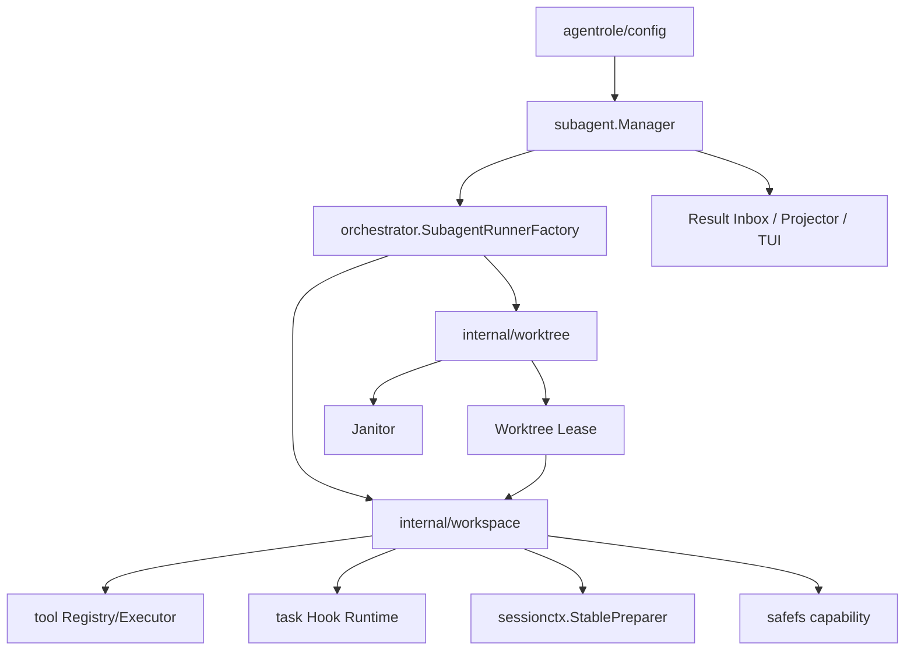
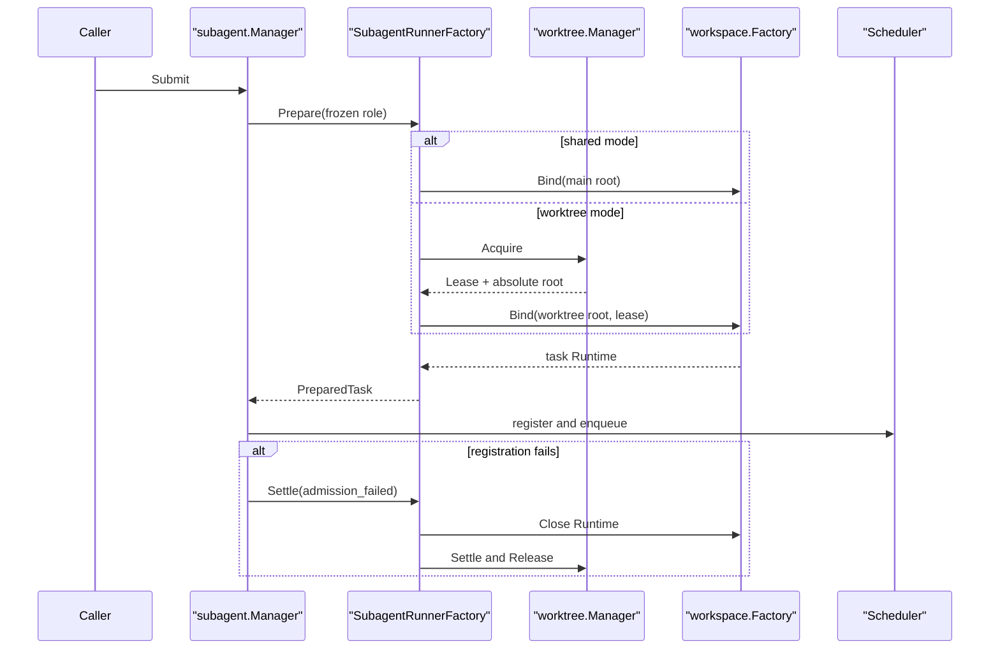
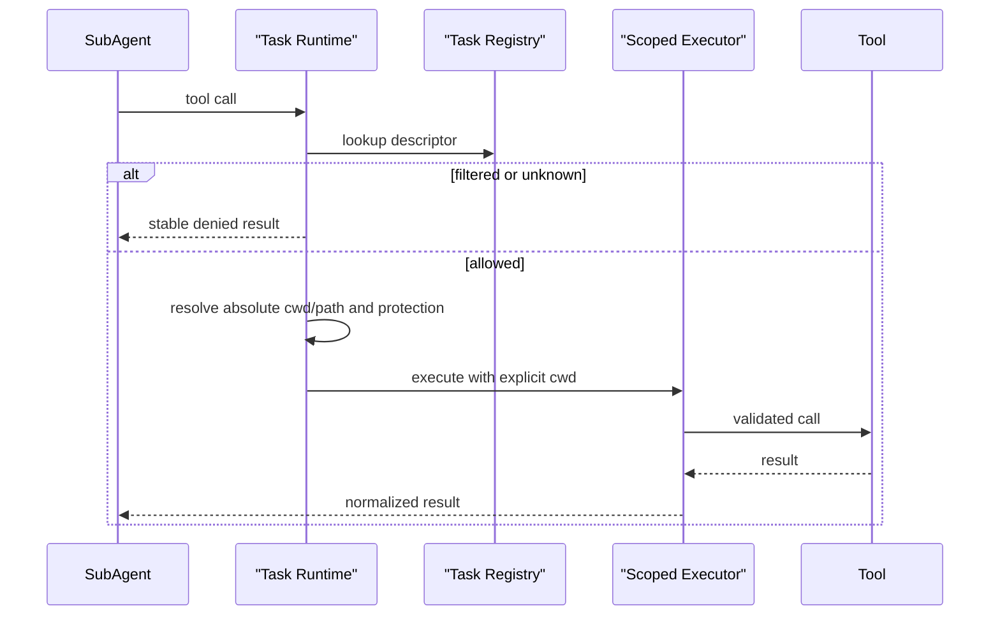
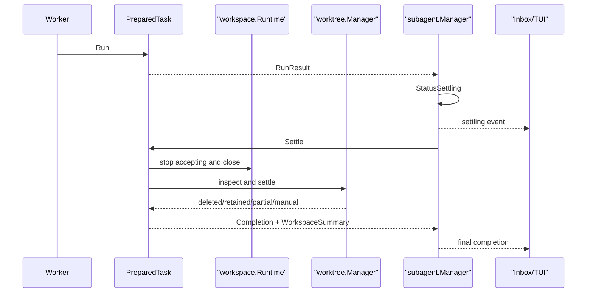
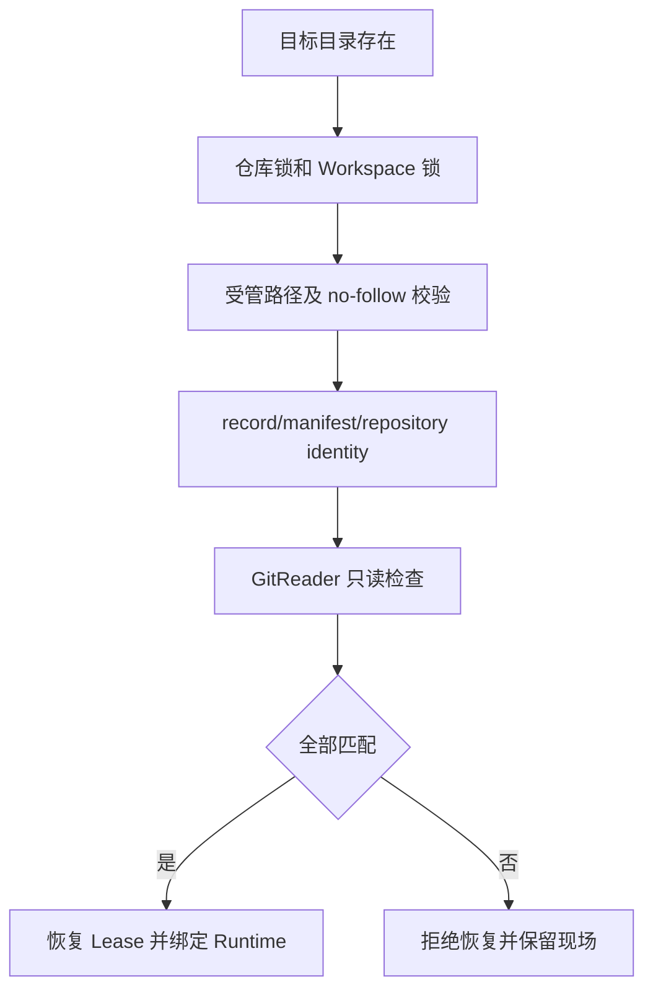

# 子 Agent Worktree 隔离 Plan

> 状态：已逐段审批；自动化实现与质量门禁已完成
> 日期：2026-08-16
> 需求基线：[spec.md](./spec.md)；验收证据：[verification.md](./verification.md)

## 1. 架构概览

本功能采用“任务级 Worktree Manager + 任务绑定 Workspace Runtime”的架构。Git Worktree 的创建、恢复、变更保护和清理由 `internal/worktree` 负责；进入 Worktree 后的工具、Hook、上下文、缓存和路径能力由 `internal/workspace` 负责。`internal/orchestrator` 只负责编排两者，不直接实现 Git 生命周期。

任务执行采用强制两阶段终态：

```text
execution stop
    -> workspace settling
    -> workspace terminal state
    -> subagent final completion
```

子 Agent 的模型执行结束、失败、取消或超时后，任务先进入 `settling`。只有 Workspace Runtime 已停止，Worktree 已安全删除、保留或转人工处理后，SubAgent Manager 才发布最终 Completion。

### 1.1 组件关系



依赖约束：

- `internal/worktree` 不依赖 `workspace`、`orchestrator`、`subagent` 或 `config`。
- `internal/workspace` 不依赖 `orchestrator` 或 `subagent`。
- `internal/sessionctx` 不依赖 `orchestrator`。
- `internal/tool` 不依赖 `workspace`。
- `internal/subagent` 不依赖 `worktree`，只保存中立的 Workspace 摘要 DTO。
- Worktree 管理 capability 不进入模型可见的 Tool Registry。

### 1.2 隔离边界

本功能提供项目工作区隔离，不宣称提供对抗同一 OS 用户的通用安全沙箱。系统仍必须阻止 XAgent 受管工具、Hook 和适配器写回主工作区；不能证明支持任务工作目录和写边界的工具在 Worktree 模式下失败关闭。

`cwd` 只负责工作目录绑定，不等于写边界。尤其是 Bash 和 Hook shell command，只有执行后端能约束子进程树的文件写入范围时才允许使用。

## 2. 核心数据结构与接口

### 2.1 Role isolation

```go
package agentrole

type IsolationMode string

const (
    IsolationNone     IsolationMode = ""
    IsolationWorktree IsolationMode = "worktree"
)

type Metadata struct {
    // 保留现有字段；这里只展示新增字段。
    Isolation IsolationMode
}
```

`Isolation` 参与角色解析、clone、snapshot、fingerprint 和冻结。只有 frontmatter 可以声明该值，任务请求不能覆盖。

### 2.2 Worktree 配置

```go
package worktree

type Config struct {
    Lifecycle LifecycleConfig
    Limits    Limits
    Init      InitConfig
}

type LifecycleConfig struct {
    RetentionTTL    time.Duration
    JanitorInterval time.Duration
    GitTimeout      time.Duration
    LockTimeout     time.Duration
    InitTimeout     time.Duration
    RecoveryTimeout time.Duration
    SettleTimeout   time.Duration
    JanitorTimeout  time.Duration
}

type Limits struct {
    MaxActive          int
    MaxRetained        int
    MaxNameBytes       int
    MaxSegmentBytes    int
    MaxDepth           int
    MaxInitFiles       int
    MaxInitBytes       int64
    MaxInitDepth       int
    MaxJanitorCandidates  int
    MaxJanitorConcurrency int
}

type InitConfig struct {
    Copy        []CopyRule
    Link        []LinkRule
    IgnoredCopy []CopyRule
    GitHooks    GitHooksRule
}

type CopyRule struct {
    Source string
    Target string
}

type LinkRule struct {
    Source string
    Target string
}

type GitHooksRule struct {
    Enabled bool
    Path    string
}
```

`internal/config` 负责 presence-aware YAML 解码、默认值和校验，再转换为上述类型；`internal/worktree` 不反向依赖配置包。

所有可配置预算同时具有代码内硬上限。Git、锁等待、初始化、恢复、结算和 Janitor 使用独立超时；初始化还受文件数、总字节、递归深度和执行时间共同限制。

### 2.3 Worktree 状态与记录

```go
package worktree

type State string

const (
    StateCreating        State = "creating"
    StateInitializing    State = "initializing"
    StateReady           State = "ready"
    StateActive          State = "active"
    StateSettling        State = "settling"
    StateRetained        State = "retained"
    StateDeleting        State = "deleting"
    StateDeleted         State = "deleted"
    StatePartial         State = "partial"
    StateManualAttention State = "manual_attention"
)

type Record struct {
    SchemaVersion      int
    Revision           uint64
    WorkspaceID        string
    OwnerID            string
    RepositoryIdentity RepositoryIdentity
    LogicalName        string
    Directory          string
    Branch             string
    BaseOID            string
    HeadOID            string
    State              State
    Manifest           ManifestRef
    Lease              LeaseRecord
    Settlement         SettlementRecord
    CreatedAt          time.Time
    UpdatedAt          time.Time
    ExpiresAt          time.Time
    IntegrityDigest    string
}
```

执行任务 ID 只用于进程内调度；跨进程所有权、恢复和删除授权使用随机 Workspace ID、Owner ID、Repository Identity、record revision 和 manifest 完整性共同决定。

### 2.4 Lease

```go
type Lease struct {
    WorkspaceID string
    OwnerID     string
    Root        string
    Branch      string
    BaseOID     string
    AcquiredAt  time.Time
}

type LeaseRecord struct {
    OwnerID    string
    Mode       string
    AcquiredAt time.Time
    Heartbeat  time.Time
}
```

OS 文件锁是互斥权威；heartbeat 只用于诊断和过期判断，不能替代文件锁。

仓库锁只覆盖 HEAD 固化、Worktree 注册、临时 ref 和权威仓库元数据等短生命周期步骤；任务执行阶段不长期持有仓库锁，不把同一仓库的多个 Agent 执行退化为全局串行，也不阻塞其他仓库。

### 2.5 Worktree Manager

```go
type Manager interface {
    Acquire(context.Context, AcquireRequest) (Lease, error)
    Settle(context.Context, Lease, SettleRequest) (Settlement, error)
    Release(context.Context, Lease) error
    Snapshot(context.Context, string) (Record, error)
    List(context.Context, ListQuery) ([]Record, error)
    Shutdown(context.Context) error
}
```

`Acquire` 负责创建或只读恢复；`Settle` 负责变更检查和删除/保留决策；`Release` 是幂等的租约释放边界。Janitor 只能通过 Manager 的统一结算/删除能力处理候选项。

### 2.6 Git 接口分离

```go
type GitReader interface {
    ResolveHEAD(context.Context, string) (string, error)
    WorktreeList(context.Context, string) ([]WorktreeInfo, error)
    Status(context.Context, string) (StatusSnapshot, error)
    SymbolicRef(context.Context, string) (string, error)
    ForEachRef(context.Context, string, string) ([]RefInfo, error)
    MergeBaseIsAncestor(context.Context, string, string, string) (bool, error)
    CheckIgnore(context.Context, string, string) (bool, error)
    ConfigGet(context.Context, string, string) (string, error)
}

type GitMutator interface {
    AddWorktree(context.Context, AddWorktreeRequest) error
    SetWorktreeConfig(context.Context, string, string, string) error
    RemoveWorktree(context.Context, string, string) error
    DeleteRefCAS(context.Context, string, string, string) error
}
```

快速恢复只持有 `GitReader`。所有 Git 调用使用结构化 argv，不拼接 shell 命令。

### 2.7 Store、Lock、Initializer 和 Janitor

```go
type Store interface {
    Create(context.Context, Record) error
    Load(context.Context, string) (Record, error)
    CompareAndSwap(context.Context, Record, uint64) error
    WriteTombstone(context.Context, Tombstone) error
    List(context.Context, ListQuery) ([]Record, error)
}

type LockManager interface {
    LockRepository(context.Context, RepositoryIdentity) (Unlock, error)
    LockWorkspace(context.Context, string) (Unlock, error)
    AcquireActiveLease(context.Context, string, string) (Unlock, error)
    AcquireDeleteLease(context.Context, string, string) (Unlock, error)
}

type Initializer interface {
    Prepare(context.Context, InitRequest) (Manifest, error)
    Verify(context.Context, VerifyRequest) error
    Rollback(context.Context, RollbackRequest) error
}

type Janitor interface {
    Start(context.Context)
    Stop(context.Context) error
    ScanOnce(context.Context) ScanResult
}
```

Store 使用 schema version、原子 rename 和 revision CAS。损坏、未知版本或身份不一致的记录进入 `manual_attention`，不能按空记录处理。

`.control`、record、manifest、锁和任务私有管理文件使用仅当前用户可访问的权限；manifest 只保存相对路径、类型、大小和不可逆摘要，不保存文件原文或凭据。

### 2.8 Tool WorkspacePolicy

```go
package tool

type WorkspaceMode string

const (
    WorkspaceUnknown     WorkspaceMode = ""
    WorkspaceIndependent WorkspaceMode = "independent"
    WorkspaceContextual  WorkspaceMode = "contextual"
    WorkspaceFixed       WorkspaceMode = "fixed"
)

type WorkspacePolicy struct {
    Mode             WorkspaceMode
    WriteContainment bool
}

type WorkspaceBinding struct {
    WorkspaceID string
    Root        string
    ScratchRoot string
}

type WorkspaceBinder interface {
    BindWorkspace(WorkspaceBinding) (Tool, error)
}
```

`ToolDescriptor` 保存可公开的 WorkspacePolicy；Binder 只留在本地可信注册边界。任务 Registry 必须先重新绑定 Contextual 工具，再应用 Role、Plan mode、前后台等单调能力过滤。

### 2.9 Workspace Factory 和 Runtime

```go
package workspace

type Factory interface {
    Bind(context.Context, BindRequest) (Runtime, error)
    Close(context.Context) error
}

type BindRequest struct {
    TaskID       string
    Isolation    agentrole.IsolationMode
    Root         string
    ScratchRoot  string
    Lease        worktree.Lease
    ReadonlyRoots []string
}

type Runtime interface {
    Root() string
    Registry() *tool.Registry
    Executor() *tool.ScopedExecutor
    Hooks() hook.Runtime
    SessionContext() sessionctx.StablePreparer
    StopAccepting()
    Close(context.Context) error
}
```

Runtime 内部持有 `safefs` capability、任务 Registry、Executor、Hook、Session Context、ReadCache 和在途调用计数，但不向 Agent 暴露 Worktree Manager。

### 2.10 Session Context

```go
package sessionctx

type StablePreparer interface {
    PrepareStable(context.Context) PreparedContext
}
```

该接口从 `orchestrator` 下沉到 `sessionctx`，避免 `workspace` 与 `orchestrator` 循环依赖。

### 2.11 Prompt Scope

```go
package prompt

type Scope string

const (
    ScopeGlobal  Scope = "global"
    ScopeUser    Scope = "user"
    ScopeProject Scope = "project"
    ScopeRuntime Scope = "runtime"
)

type Section struct {
    Name     string
    Priority int
    Content  string
    Stable   bool
    Scope    Scope
}
```

Scope 进入 Provider prompt snapshot 及 fingerprint。Worktree Fork 保留 Global/User，丢弃并重新构建 Project/Runtime；不能通过 block name 猜测作用域。

Fork 继续保留父会话消息，但父消息之外的项目绑定稳定上下文按 Scope 过滤。任务私有 Runtime 说明明确注入绝对 Worktree 根、Base OID、本地临时分支、允许的外部只读区域，以及禁止写入主工作区和其他 Worktree 的边界；这些绝对路径不得进入跨任务结果或普通遥测。

### 2.12 SubAgent 两阶段结果

```go
package subagent

type RunResult struct {
    Status     Status
    StopReason StopReason
    Summary    redact.SafeText
    Usage      Usage
    Error      *diagnostics.SafeError
}

type WorkspaceSummary struct {
    WorkspaceID    string
    Isolation      string
    State          string
    BaseOID        string
    Branch         string
    Dirty          bool
    Unpushed       bool
    Cleanup        string
    RetentionCause string
    Error          *diagnostics.SafeError
}

type Completion struct {
    // 保留现有字段；这里只展示新增字段。
    Workspace WorkspaceSummary
}

type PreparedTask interface {
    Run(context.Context, EventSink) RunResult
    Settle(context.Context, RunResult) Completion
    Metadata() PreparedMetadata
}
```

新增 `StatusSettling`。`Settle` 必须幂等；任务终态、`EndedAt` 和 Inbox 投影只能在结算完成后产生。

## 3. 模块设计

### 3.1 `internal/agentrole`

职责：严格解析 `isolation: worktree`，把 isolation 纳入角色冻结、clone、snapshot 和 fingerprint。该包不执行 Git 操作，也不判断当前仓库是否支持 Worktree。

### 3.2 `internal/config`

职责：在 `subagent.worktree.lifecycle/init/limits` 下解析显式规则，保留 absent 与显式空列表的区别，应用 24 小时默认保留 TTL 等已批准默认值。配置存在不代表自动启用隔离。

### 3.3 `internal/worktree/path.go`

受管布局：

```text
<project-root>/.xagent/worktrees/
├── .control/
│   ├── repository.json
│   ├── records/
│   ├── locks/
│   └── diagnostics/
└── tasks/
    └── <workspace-id-prefix>/
        └── <workspace-id>/
```

本地临时分支固定为：

```text
xagent/worktree/<workspace-id>
```

角色名、任务正文和模型生成文本不进入实际分支名。逻辑名称可以允许安全斜杠嵌套，但只作为经过验证的展示/映射输入。

路径模块执行字符、长度、`.`/`..`、`.git`、保留段、大小写等价、符号链接和受管根边界校验。修改前在同一锁内再次校验，阻止 TOCTOU。

### 3.4 `internal/worktree/git.go`

Git client 只执行明确 allowlist 中的 argv：

- 读取：`rev-parse`、`check-ignore`、`worktree list`、`status`、`symbolic-ref`、`for-each-ref`、`merge-base`、`config --get`。
- 修改：`worktree add`、`config --worktree`、非强制 `worktree remove`、带 expected OID 的 `update-ref -d`。

禁止 `worktree repair`、`prune`、`reset --hard`、`clean`、`branch -D`、远端分支删除和任何 force 删除。

### 3.5 `internal/worktree/store.go`

权威状态保存在子 Agent 写边界之外的 `.control` 中。写入采用临时文件、同步和原子 rename；更新采用 revision CAS。每条记录包含完整性摘要；不可信内容不能授权删除。

### 3.6 `internal/worktree/lock.go`

固定锁顺序：

```text
Repository Lock
    -> Workspace Lock
        -> Active Shared Lease / Delete Exclusive Lease
```

OS 文件锁是权威。反向取锁被禁止；Janitor 获取不到锁时跳过，不等待。

### 3.7 `internal/worktree/initializer.go`

初始化器只执行项目显式 allowlist：

- 复制本地配置；
- 复制显式 ignored runtime 文件；
- 建立只读共享依赖软链；
- 启用 `extensions.worktreeConfig` 并通过 `git config --worktree core.hooksPath` 设置 hooks。

复制只读取普通文件和真实目录，不跟随源内符号链接，拒绝设备、FIFO、Socket 和特殊权限位；不扫描或猜测 `.env`、凭据和用户目录内容。初始化开始前写入预期产物 manifest。回滚只删除 manifest 可证明由本事务创建且内容未变化的产物。

软链目标本身永不删除；共享依赖同时加入 Workspace 只读保护计划。Initializer 在创建共享软链前必须从 Workspace 能力探测确认该目标能够保持只读，否则拒绝该规则。启用仓库级 `extensions.worktreeConfig` 是显式、幂等、可验证且可安全回滚的仓库准备步骤，不能改变用户全局 Git 配置。

### 3.8 `internal/worktree/manager.go`

`Acquire`：

1. 校验仓库、受管根、忽略规则和配额；
2. 取得仓库锁并把当前 `HEAD` 解析为不可变 OID；
3. 创建 `creating` record；
4. 创建临时分支和 Worktree；
5. 切换为 `initializing`；
6. 执行初始化并发布 manifest；
7. 原子切换为 `ready`；
8. 获取 Active lease 并切换为 `active`。

目录已存在时走只读恢复：交叉校验 record、manifest、仓库 identity、Worktree 注册、分支、HEAD、base OID 和 Git 管理文件。需要修复时拒绝恢复。

`Settle`：

1. 切换为 `settling`；
2. 确认任务 Runtime 已停止写入；
3. 检查 staged、unstaged、conflict、intent-to-add、untracked、额外 ignored 文件、子模块/嵌套仓库变化、初始化产物指纹、HEAD 和 upstream；
4. dirty、unpushed 或 unknown 时切换为 `retained`；
5. 可安全删除时取得独占 lease，删除未变化的初始化产物；
6. 非强制移除 Worktree；
7. 用 expected OID 删除本地临时分支；
8. 写 tombstone 并切换为 `deleted`；
9. 部分失败进入 `partial`，身份异常进入 `manual_attention`。

upstream 只有在配置为有效远端 tracking ref，且临时分支当前 tip 可达于本地可见的该 tracking ref 时，才能证明已推送。upstream 为本地分支、引用缺失、无法解析或 tip 不可达时均按未推送处理。自动删除前还要确认临时分支未被其他 Worktree 使用。

### 3.9 `internal/worktree/janitor.go`

Janitor 在启动后和运行期间扫描，使用三层过滤：受管路径、XAgent 身份、生命周期安全。它不实现独立删除算法，只调用 Manager 的统一结算/删除逻辑；不 force、不联网、不自动 commit/push，也不绕过 dirty/unpushed 保护。

过期时间从任务首次进入终态时计算，重复扫描和失败检查不刷新；没有终态的中断资源按最后一次有效 lease 时间计算。TTL 具有安全最小值和最大值。每轮候选数、总执行时间和并发数均可配置且受硬上限约束，达到预算立即停止并把剩余候选留给后续轮次。扫描只短暂、非阻塞地尝试锁，始终为前台生命周期让路。

### 3.10 `internal/tool`

任务绑定发生在能力过滤之前。Contextual 工具基于 Worktree 根重新构造；Independent 工具可复用；Fixed 和 Unknown 工具过滤。任务专属 Registry 使用新 lineage，其前后台视图继续保持单调收窄。

首版策略：

| 工具类型 | Worktree 行为 |
|---|---|
| Read/Write/Edit/Glob/Grep | Contextual，重新绑定 |
| Bash | 仅有可信写隔离后端时允许，否则过滤 |
| Agent | Fixed/递归委派规则过滤 |
| `load_skill` | Fixed，首版过滤 |
| stdio MCP | Fixed，首版过滤 |
| HTTP MCP | 默认 Unknown；本地可信配置可标记 Independent |

远端 annotations 只能收窄，不能提升 Workspace 能力。

### 3.11 `internal/workspace`

Workspace Factory 为每个任务绑定：绝对根、Workspace ID、scratch/artifact 根、动态保护计划、任务 Registry、ScopedExecutor、Hook Runtime、Session Context 和 ReadCache。

允许写入 Worktree、任务 scratch 和明确 artifact 根；系统工具链、Git 公共 metadata、用户级只读配置和显式共享依赖只能按只读例外访问，主工作区与其他 Worktree 不可写。Runtime 不调用进程级 `chdir`，每次工具执行显式传递 cwd。

### 3.12 `internal/sessionctx`、instructions 和 memory

`sessionctx.StablePreparer` 成为下层接口。每个 Worktree 从自己的绝对根构造项目上下文。instructions expansion、文件内容、系统提示词、项目记忆和读取缓存以绝对路径或等价根身份隔离；用户级内容可以共享，项目级内容重新构建。

### 3.13 Prompt 和 Fork

Prompt Section/Block 带 Scope，并在 Provider Snapshot 中持久化和参与 fingerprint。Worktree Fork 不完整克隆父快照：保留 Global/User，删除 Project/Runtime，再从子 Worktree 构建项目指令和任务运行时内容。

### 3.14 Hook 和 MCP

Assembly 保留不可变 Hook 配置快照；每个 Worktree 创建根绑定 Hook Runtime。HTTP runner 等真正无目录依赖的资源可以借用；命令动作按 Bash 的写隔离能力规则过滤或阻止任务启动。

stdio MCP 因服务进程通常固定主 cwd，首版过滤。HTTP MCP 只有本地可信策略声明 Independent 时允许。

### 3.15 `internal/orchestrator`

`SubagentRunnerFactory` 接收 Worktree Manager 和 Workspace Factory。它冻结 Role，选择 shared/worktree 路径，创建资源并返回同时实现 `Run` 与 `Settle` 的 PreparedTask。Defined 与 Fork 共享生命周期骨架，仅上下文构造不同。

### 3.16 `internal/subagent`

Manager 和 Scheduler 增加 `settling` 状态。排队取消、运行取消、超时、关闭以及 Prepare 后注册/发布失败都必须调用 `Settle`。Inbox 只接收已结算 Completion。

### 3.17 App/TUI

UI 分别展示执行状态和结算状态，最终展示 deleted/retained/partial/manual_attention 及固定保留原因。公开结果不包含绝对路径，也不提供强制删除、自动提交、推送或合并入口。

## 4. 模块交互与时序

### 4.1 提交与准备



`Submit` 成功返回前，Worktree、初始化、Runtime 和队列注册必须全部成功。PreparedTask 一旦创建，所有后续错误路径都必须结算。

### 4.2 进入 Worktree

“进入”指创建任务绑定 Runtime，不调用 `chdir`：

```text
WorkspaceRoot  = normalized absolute Worktree path
WorkspaceID    = immutable random identity
RepositoryID   = repository identity digest
ScratchRoot    = task-private temporary root
ProtectionPlan = writable and readonly roots
ToolRegistry   = task-bound filtered registry
HookRuntime    = task-root-bound hooks
SessionContext = task-root-bound project context
```

每次工具调用从 Task Runtime 获取绝对 cwd 和路径策略；工具不能从全局当前目录推断工作区。

### 4.3 工具调用



有副作用的路径操作在锁内重验受管根、路径分段、符号链接和身份；发现替换或漂移立即停止。

### 4.4 两阶段完成



固定结算顺序：拒绝新工具调用、取消上下文、等待在途调用、关闭 Hook/Session/适配器、检查 Git、删除或保留、释放 lease、生成脱敏摘要、发布终态。

### 4.5 删除判定

| 状态 | 行为 |
|---|---|
| staged、unstaged、conflict、intent-to-add 或 untracked 变更 | 保留 |
| 子模块、嵌套仓库、额外 ignored 文件或初始化产物变化 | 保留 |
| base 之后有 commit 且无 upstream | 保留 |
| 本地领先 upstream | 保留 |
| upstream 无法可靠判断 | 保留 |
| 干净且无未推送 commit | 允许安全删除 |
| 身份、manifest、Git 或 lease 不一致 | manual_attention |
| 工具仍可能写入 | retained 或 partial |

删除不主动 fetch。只有配置为有效远端 tracking ref，且 HEAD 可达于该本地可见引用时，才继续删除检查。

### 4.6 取消、超时和关闭

- 排队取消：`ready -> settling -> terminal`。
- 运行取消：取消执行、等待工具静止、再结算。
- 超时：执行结果为 timed_out，但仍必须完成 Workspace 结算。
- 关闭：先停止 Janitor 新扫描，再停止任务准入并结算任务；达到期限时保留仍可能活跃的 Worktree。

### 4.7 快速恢复



恢复不得执行 Worktree repair、配置写入、初始化补齐或 ref 修改。

### 4.8 Janitor

```text
scan candidate
  -> path filter
  -> identity filter
  -> non-blocking lock
  -> TTL and lease filter
  -> dirty/unpushed protection
  -> Manager unified deletion
```

## 5. 文件组织

### 5.1 新增文件

```text
.gitignore
internal/worktree/
├── types.go
├── config.go
├── errors.go
├── path.go
├── identity.go
├── git.go
├── store.go
├── lock.go
├── lock_posix.go
├── lock_windows.go
├── lock_unsupported.go
├── manifest.go
├── initializer.go
├── manager.go
├── janitor.go
└── *_test.go
internal/workspace/
├── types.go
├── factory.go
├── runtime.go
├── protection.go
├── tool_binding.go
├── hook_binding.go
├── context_binding.go
└── *_test.go
internal/tool/
├── workspace_policy.go
├── workspace_binding.go
└── workspace_binding_test.go
internal/sessionctx/
├── stable.go
├── project_factory.go
└── project_factory_test.go
internal/hook/
├── factory.go
└── factory_test.go
cmd/xagent/
├── assembly_worktrees.go
└── assembly_worktrees_test.go
```

`.gitignore` 只新增：

```gitignore
/.xagent/worktrees/
```

创建前仍调用 `git check-ignore` 验证规则生效。不得忽略整个 `.xagent/`。

### 5.2 修改文件

| 模块 | 文件 | 主要改动 |
|---|---|---|
| agentrole | `types.go`、`parser.go`、`snapshot.go` 及测试 | isolation 严格解析、clone、fingerprint |
| config | `config.go`、`partial.go`、`resolve.go`、`validate.go` 及测试 | Worktree 配置、默认值和 presence |
| tool | `registry.go`、`view.go`、`executor.go`、`scoped_executor.go`、`read_cache.go`、内置工具 | WorkspacePolicy、重新绑定、绝对路径缓存 |
| safefs | `api.go`、`policy.go`、`path.go`、平台 root 文件 | 动态只读/可写保护计划 |
| session context | `manager.go`、instructions、memory 相关文件 | 根绑定 context 和绝对路径 identity |
| prompt/provider | `prompt/section.go`、`builder.go`、`provider/prompt_snapshot.go` 及测试 | Scope、快照和 Fork 过滤 |
| hook/MCP | Hook loader/engine/command、MCP adapter/factory/manager | 任务根绑定和 WorkspacePolicy |
| orchestrator | `subagent_runner.go`、`task_runtime.go`、`result_projection.go`、路由及测试 | Acquire/Bind、Run/Settle、摘要投影 |
| subagent | `types.go`、`manager.go`、`scheduler.go`、Inbox/EventHub 及测试 | settling 状态和两阶段完成 |
| app | tasks、task events、state、update 及测试 | settling 和保留原因显示 |
| Assembly | `assembly.go`、`assembly_subagents.go`、`assembly_context.go`、`lifecycle.go` 及测试 | Worktree/Workspace/Janitor 组合和关闭 |

### 5.3 Assembly 所有者顺序

ownership registry 逆序关闭，因此注册顺序为：

```text
1. Worktree Manager
2. Workspace Factory
3. ordinary Orchestrator WaitIdle
4. Result Inbox
5. SubAgent Manager
6. Janitor
```

关闭顺序为：

```text
Janitor
  -> SubAgent Manager
  -> Result Inbox
  -> Orchestrator WaitIdle
  -> Workspace Factory
  -> Worktree Manager
```

正常关闭和 Assembly 构造失败使用同一个 ownership registry 回滚路径。

## 6. 技术决策

### 6.1 Spec 功能覆盖

| Spec 需求 | 架构归属 |
|---|---|
| F1–F6 隔离声明与身份 | `agentrole` 冻结 isolation；Orchestrator 按任务分配 Workspace ID 和资源所有权 |
| F7–F17 受管根与路径安全 | `worktree/path`、Repository Identity、no-follow 校验、同锁重验和精确 ignore 规则 |
| F18–F26 创建、状态和并发 | `worktree.Manager`、Store 原子状态、仓库/Workspace 锁和 lease |
| F27–F32 只读快速恢复 | 只注入 `GitReader` 的 Recovery 路径和 manifest/identity 交叉验证 |
| F33–F45 环境初始化 | 显式 InitConfig、Initializer、manifest、预算和可证明回滚 |
| F46–F59 任务 Runtime 与工具 | `workspace.Factory`、safefs、工具重新绑定、WorkspacePolicy、Hook/MCP 过滤 |
| F60–F66 Prompt、指令、Memory、缓存 | `sessionctx.StablePreparer`、Prompt Scope、绝对路径 identity 和任务私有缓存 |
| F67–F81 结算与变更保护 | `PreparedTask.Run/Settle`、StatusSettling、完整 protected-change 检查和 ref CAS 删除 |
| F82–F90 后台清理 | 启动/定期 Janitor、三层过滤、TTL/lease 规则、单轮预算和有界诊断 |

### 6.2 关键决策

| 决策点 | 选择 | 理由 |
|---|---|---|
| 隔离粒度 | 每个 SubAgent 任务一个 Worktree | 同角色并发任务也不能共享文件状态 |
| 基线 | 委派时当前 HEAD commit | 不继承主目录未提交修改，结果可重复 |
| 启用入口 | 仅角色 `isolation: worktree` | 隔离要求属于角色契约，不能被请求降级 |
| 受管根 | 仓库内 `/.xagent/worktrees/` | 生命周期集中、可精确忽略、绑定仓库身份 |
| 分支命名 | `xagent/worktree/<workspace-id>` | 不信任模型文本，避免冲突和路径注入 |
| 快速恢复 | 只读 GitReader | 避免“恢复”隐式改变用户仓库 |
| 工作目录切换 | 显式 cwd，不调用 chdir | 并发任务互不影响，缓存可按绝对路径隔离 |
| 工具处理 | 先按根重新绑定，再做能力过滤 | 当前 Registry View 会复用主根工具实例 |
| Bash | 无写隔离能力时过滤 | cwd 不能阻止命令写回主目录 |
| stdio MCP | 首版过滤 | 服务进程通常在 Assembly 时绑定主 cwd |
| Hook command | 与 Bash 使用相同写边界要求 | Hook 也可能通过子进程逃逸 cwd |
| 结算 | 强制两阶段完成 | 不向用户报告“完成”后再异步丢失工作区 |
| 删除保护 | dirty、unpushed、unknown 均保留 | 用户成果保护优先于磁盘回收 |
| 分支删除 | 本地 expected OID CAS | 防止并发移动分支后误删 |
| Janitor | 复用 Manager 删除逻辑 | 防止后台清理形成更宽松的第二路径 |
| 远端状态 | 不 fetch、不删远端 | 清理不引入网络副作用；远端成果永不自动删除 |
| 初始化 | 显式 allowlist、整体成功 | 不扫描敏感文件，不启动半初始化任务 |
| 锁 | 仓库锁→Workspace 锁→lease | 跨进程一致性并避免锁顺序死锁 |
| 不支持平台 | 仅 Worktree 任务失败 | 不阻断现有共享模式和主 Agent |

## 7. 测试与验收策略

### 7.1 测试层次

1. 纯函数/契约：名称、路径、状态、record、配置、scope 和能力过滤。
2. Worktree 生命周期单测：fake Git、Store、Lock、Initializer、Clock 和故障注入。
3. 真实 Git 集成：临时主仓库和本地 bare remote，不访问网络或用户仓库。
4. Workspace 工具隔离：同名文件、根重新绑定、写边界和缓存隔离。
5. Orchestrator/SubAgent：Defined、Fork、前后台、取消、超时和两阶段终态。
6. Assembly/端到端：装配、关闭、Janitor 和 UI 摘要。

### 7.2 必测安全场景

- 名称拒绝空段、`.`、`..`、绝对路径、反斜杠、控制字符、超长段和路径逃逸。
- 路径组件或受管根被替换为符号链接时失败。
- 主工作区 dirty 不阻止创建，但其改动不进入 Worktree。
- 目录已存在时只读恢复；fake Git 断言没有任何 mutating 调用。
- 初始化各步骤故障只回滚 manifest 可证明且未变化的产物。
- Worktree 工具读取/写入子根，主工作区内容和时间戳不变。
- `load_skill`、stdio MCP、Unknown 工具和无写隔离的 Bash 被过滤。
- Fork 只保留 Global/User，Project/Runtime 从子根重建。
- staged、unstaged、conflict、intent-to-add、untracked、额外 ignored、子模块/嵌套仓库变化、无 upstream、本地领先和 upstream unknown 全部保留。
- clean 且无未推送 commit 时非强制删除目录，并用 expected OID 删除本地分支。
- 不存在远端分支删除、force、reset、clean、repair 或 prune。
- Janitor 路径、身份、TTL/lease 三层过滤均通过才调用 Manager；候选数、总时长和并发预算达到上限时停止本轮。
- 两个进程竞争同一 Workspace 时最多一个获得 Active lease。
- heartbeat 过期但 OS 锁仍在时不得删除。
- 每个持久化检查点崩溃后均能恢复为可解释状态。
- SafeError、Inbox、日志和 TUI 不泄露绝对路径、凭据或初始化文件内容。

### 7.3 状态结果矩阵

| 执行结果 | 必经状态 |
|---|---|
| 正常完成 | running → settling → completed |
| Provider/Tool 失败 | running → settling → failed |
| 达到限制 | running → settling → limit_reached |
| 排队取消 | queued → settling → cancelled |
| 运行取消 | running → settling → cancelled |
| 超时 | running → settling → timed_out |
| 应用关闭 | queued/running → settling → cancelled |

每个场景断言 `Settle` 幂等执行、Inbox 在结算前无 Completion、`EndedAt` 在结算后生成，并且执行成功与 Workspace 删除是两个独立结论。

### 7.4 并发和崩溃

跨进程测试使用测试子进程，不用 goroutine 代替 OS 锁。覆盖 Acquire/删除竞争、Janitor/Active 竞争、双 Janitor、Settle/Cancel/Shutdown 竞争和 Store CAS 冲突。

故障注入检查点覆盖：creating record、worktree add、initializing、每个初始化产物、manifest 发布、ready、active lease、settling、worktree remove、branch CAS 和 tombstone。

### 7.5 验证命令

```bash
go test ./internal/agentrole ./internal/config
go test ./internal/worktree
go test ./internal/safefs ./internal/tool ./internal/instructions ./internal/memory ./internal/sessionctx ./internal/hook ./internal/workspace
go test ./internal/orchestrator ./internal/subagent
go test ./cmd/xagent ./internal/app
go test ./...
go test -race ./internal/worktree ./internal/workspace ./internal/subagent ./internal/orchestrator
go vet ./...
go build ./cmd/xagent
git diff --check
```

真实 Git 测试设置测试专用 `GIT_CONFIG_GLOBAL`、`GIT_CONFIG_SYSTEM`、author/committer 和 `GIT_TERMINAL_PROMPT=0`，不复用或改写 `$HOME`。环境没有 Git 时只 skip 真实集成层，纯单测仍需通过。

## 8. 实施阶段

### 阶段 1：领域契约和兼容骨架

加入 Role isolation、配置、Worktree/Workspace 接口、`sessionctx.StablePreparer`、RunResult/Settle 和 shared-mode no-op settlement。保持现有共享任务行为。

### 阶段 2：Worktree 安全基础设施

按 path/identity → record/store → lock → GitReader → GitMutator → manifest 的顺序实现，并先完成单测和 race。

### 阶段 3：创建、初始化、恢复和结算

实现 Manager 的 Acquire、初始化、只读恢复、变更检查、安全删除、保留、partial/manual 和崩溃收敛；使用临时真实 Git 仓库验证。

### 阶段 4：Workspace Runtime 与工具绑定

实现 safefs 根能力、保护计划、工具重新绑定、任务 Registry/Executor/Cache 和幂等 Runtime Close。无可信写隔离时过滤 Bash。

### 阶段 5：上下文、Prompt、Hook 和 MCP

实现绝对路径上下文/缓存、Prompt Scope、Fork 重建、任务 Hook Runtime 和 MCP WorkspacePolicy。Hook command 使用 Bash 的写隔离规则。

### 阶段 6：Orchestrator 和 SubAgent

接入 Role 冻结、Acquire/Bind、Defined/Fork、Run/Settle、所有错误出口、StatusSettling 和最终摘要。完成前不启用真实 Worktree 角色执行。

### 阶段 7：Assembly、Janitor 和 UI

接入所有者注册、失败回滚、关闭顺序、Janitor、指标和 TUI。Janitor 最后接入，避免生命周期尚未统一时产生第二删除路径。

### 阶段 8：完整验证和文档收敛

运行全量 test/race/vet/build/diff，执行临时 Git 端到端验收，并同步配置、角色、保留目录人工处理和错误码文档。

## 9. 迁移、降级与回滚

### 9.1 启用和兼容

- 未声明 isolation 的 Role 行为不变。
- Git、文件锁或受管根能力不可用时，只拒绝 Worktree 任务，不阻断 XAgent 和 shared 模式启动。
- 非 Git 项目中的 Worktree 任务返回稳定错误。
- 内置角色默认不启用 Worktree。
- Worktree 配置存在不等于启用隔离。

### 9.2 状态迁移

首版 schema 为 v1。不自动接管没有合法 `.control` 记录的目录、手工 Git worktree、身份不匹配目录、损坏 manifest 或未知 schema。未来迁移必须显式版本化，迁移前只读，失败时保留现场。

### 9.3 降级

| 失败点 | 行为 |
|---|---|
| Git/锁不支持 | Worktree 任务失败，shared 模式继续 |
| 受管根未忽略 | 创建前失败 |
| Bash/Hook command 无写隔离 | 过滤；强制安全约束无法满足时任务失败 |
| stdio MCP/Unknown HTTP MCP | 过滤 |
| 恢复需要 repair | 拒绝恢复 |
| Git/upstream 状态未知 | 保留 |
| Janitor 无锁 | 跳过 |
| manifest/schema/identity 异常 | manual_attention |
| 关闭超时 | 保留可能活跃的 Worktree |

所有降级只能减少能力或保留现场，不能扩大权限或提高删除能力。

### 9.4 代码回滚

回滚旧版本不自动删除 `.xagent/worktrees/`、本地临时分支或 retained 工作区；`.gitignore` 可保留。旧版 strict Role parser 不识别 `isolation`，回滚时需要暂时移除或停用带该字段的角色文件。正在运行的新版任务必须先正常 shutdown 和结算，不能通过删除目录完成回滚。

## 10. 风险控制

| 风险 | 控制 |
|---|---|
| 路径遍历/误删 | 严格名称、绝对受管根、逐段 no-follow、锁内重验 |
| symlink TOCTOU | 身份检查与操作同锁；平台不支持时失败关闭 |
| Git 公共状态损坏 | 仓库锁、结构化 argv、非 force、ref CAS |
| 错判已推送 | 不 fetch；无 upstream、领先或未知时保留 |
| 工具仍指向主根 | 先重绑定实例，再做能力过滤 |
| Bash/Hook 逃逸 | 无可信写隔离即过滤 |
| Fork/缓存污染 | Prompt Scope、任务私有缓存、绝对路径 key |
| 终态早于清理 | 强制 settling 和两阶段完成 |
| Janitor 误删 | 三层过滤并复用 Manager |
| 多进程冲突 | OS 锁、lease、固定锁顺序、Store CAS |
| 崩溃半状态 | 原子 record、manifest、tombstone、显式中间状态 |
| 磁盘增长 | 活跃/保留配额和 TTL，不牺牲变更保护 |

## 11. 范围边界

本次不实现：自动 merge/rebase/cherry-pick、冲突解决、自动 commit/push、远端分支管理、主目录与 Worktree 同步、多 Agent DAG 编排、任务自动拆分、通用 OS 用户沙箱、非 XAgent Worktree 治理或历史目录自动接管。

## 12. 完成定义

- Spec、Plan、Task、Checklist 全部获批后才进入实现。
- Role isolation 严格解析，shared 模式无行为回归。
- 每个隔离任务拥有独立 Worktree 和本地分支。
- 创建、初始化、只读恢复、进入、结算、保留、删除和 Janitor 生命周期完整。
- 工具、Hook、上下文、记忆和缓存绑定任务绝对根，不调用进程级 `chdir`。
- 所有执行出口经过 `settling`。
- dirty、unpushed 和 unknown 状态全部受保护；不删除远端分支。
- Janitor 使用三层过滤和 Manager 的统一删除逻辑。
- 多进程、TOCTOU、崩溃和故障注入测试通过。
- 全量 test、目标 race、vet、build、diff check 和真实 Git 临时仓库验收通过。
- 最终实现与本 Plan、Spec 和后续 Checklist 一致。
