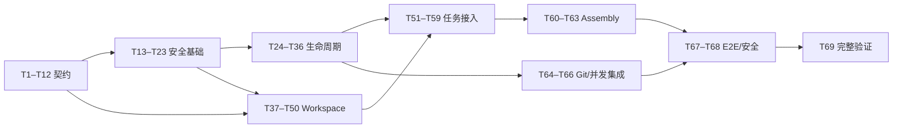

# 子 Agent Worktree 隔离 Tasks

> 状态：T1–T69 自动化实现已完成；人工 tmux 验收待执行
> 依赖：[spec.md](./spec.md)、[plan.md](./plan.md)
> 规则：每个任务先补对应测试，再做最小实现；验证通过后才能进入依赖它的任务。最终证据见 [verification.md](./verification.md)。

## 文件清单

| 操作 | 文件/目录 | 职责 |
|---|---|---|
| 新建 | `.gitignore` | 精确忽略 `/.xagent/worktrees/` |
| 新建 | `internal/worktree/*.go` | Worktree 身份、路径、Git、Store、锁、初始化、Manager、Janitor |
| 新建 | `internal/workspace/*.go` | 任务根绑定、工具/Hook/Context、保护计划和 Runtime 生命周期 |
| 新建 | `internal/tool/workspace_policy.go`、`workspace_binding.go` | 工具 Workspace 能力与重新绑定 |
| 新建 | `internal/sessionctx/stable.go`、`project_factory.go` | 下沉稳定上下文接口并按任务根构造 |
| 新建 | `internal/hook/factory.go` | 从不可变配置快照创建任务 Hook Runtime |
| 新建 | `cmd/xagent/assembly_worktrees.go` | Worktree/Workspace/Janitor 组合根 |
| 修改 | `internal/agentrole/{types,parser,snapshot}.go` | `isolation: worktree` 严格解析和冻结 |
| 修改 | `internal/config/{config,partial,resolve,validate}.go` | Worktree 配置 presence、默认值与硬上限 |
| 修改 | `internal/tool`、`internal/safefs` | 根重新绑定、写边界和绝对路径缓存 |
| 修改 | `internal/prompt`、`internal/provider/prompt_snapshot.go` | Prompt Scope 与 Fork 过滤 |
| 修改 | `internal/instructions`、`internal/memory`、`internal/sessionctx` | 项目上下文和缓存按绝对根隔离 |
| 修改 | `internal/hook`、`internal/mcpclient` | Hook/MCP WorkspacePolicy |
| 修改 | `internal/orchestrator`、`internal/subagent` | Acquire/Bind、Run/Settle、`settling` 和结果摘要 |
| 修改 | `internal/app` | 结算状态和保留原因展示 |
| 修改 | `cmd/xagent/{assembly,assembly_subagents,lifecycle}.go` | 装配、回滚和关闭顺序 |
| 新建/修改 | 对应 `*_test.go` | 单元、集成、跨进程、故障注入和端到端验证 |

## A. 契约与兼容骨架

## T1：加入精确 Worktree ignore 规则

**文件：** `.gitignore`、`cmd/xagent/assembly_worktrees_test.go`
**依赖：** 无
**步骤：** 新建根 `.gitignore`，只加入 `/.xagent/worktrees/`；测试拒绝扩大为整个 `.xagent/`。
**验证：** `go test ./cmd/xagent -run WorktreeIgnore`

## T2：定义 Worktree 配置、状态和安全错误

**文件：** `internal/worktree/config.go`、`types.go`、`errors.go`、对应测试
**依赖：** 无
**步骤：** 定义 Config、Limits、State、Record、Lease、Settlement 和固定错误码；补合法性与 clone 测试。
**验证：** `go test ./internal/worktree -run 'Config|State|Record|Error'`

## T3：扩展 Role isolation 类型

**文件：** `internal/agentrole/types.go`、`types_contract_test.go`
**依赖：** 无
**步骤：** 增加 `IsolationMode` 和 Metadata 字段；测试空值与 `worktree` 的契约。
**验证：** `go test ./internal/agentrole -run Isolation`

## T4：严格解析 isolation frontmatter

**文件：** `internal/agentrole/parser.go`、`parser_test.go`
**依赖：** T3
**步骤：** 将 `isolation` 加入严格字段表；接受省略或 `worktree`，拒绝显式空值、其他类型和值并返回脱敏诊断。
**验证：** `go test ./internal/agentrole -run Isolation`

## T5：把 isolation 纳入角色快照与指纹

**文件：** `internal/agentrole/snapshot.go`、manager/model 相关测试
**依赖：** T3、T4
**步骤：** 更新 clone、snapshot、fingerprint；验证修改 isolation 会改变指纹，冻结角色不受文件后续变化影响。
**验证：** `go test ./internal/agentrole -run 'Snapshot|Fingerprint|Isolation'`

## T6：增加 Worktree presence-aware 配置

**文件：** `internal/config/config.go`、`partial.go`、`subagent_presence_test.go`
**依赖：** T2
**步骤：** 增加 lifecycle、limits、init 的 resolved/partial 结构；测试 absent、空列表和显式值可区分。
**验证：** `go test ./internal/config -run 'Worktree|Presence'`

## T7：解析默认值、超时和硬上限

**文件：** `internal/config/resolve.go`、`validate.go`、`resolve_test.go`
**依赖：** T6
**步骤：** 应用 24h TTL、各阶段超时、初始化与 Janitor 预算；拒绝超出安全最小/最大值的配置。
**验证：** `go test ./internal/config -run Worktree`

## T8：下沉 StablePreparer 接口

**文件：** `internal/sessionctx/stable.go`、`internal/orchestrator/subagent_runner.go` 及测试
**依赖：** 无
**步骤：** 在 sessionctx 定义接口；迁移现有实现和调用方，删除 orchestrator 内同名接口。
**验证：** `go test ./internal/sessionctx ./internal/orchestrator -run Stable`

## T9：为 Prompt Section 增加 Scope

**文件：** `internal/prompt/section.go`、`sections.go`、`builder.go`、`prompt_test.go`
**依赖：** 无
**步骤：** 定义四种 Scope；为所有现有固定、用户、项目和运行时 block 指定明确 scope。
**验证：** `go test ./internal/prompt -run Scope`

## T10：在 Provider 快照中保存 Scope

**文件：** `internal/provider/prompt_snapshot.go`、`prompt_snapshot_test.go`
**依赖：** T9
**步骤：** 深拷贝、校验并 fingerprint scope；缺失/非法 scope 失败关闭。
**验证：** `go test ./internal/provider -run PromptPrefixSnapshot`

## T11：定义 RunResult、WorkspaceSummary 和 settling

**文件：** `internal/subagent/types.go`、`types_test.go`
**依赖：** T2
**步骤：** 增加 `StatusSettling`、RunResult 和含 BaseOID 的中立 WorkspaceSummary；更新状态迁移与验证。
**验证：** `go test ./internal/subagent -run 'Status|Completion|Workspace'`

## T12：迁移 PreparedTask 两阶段接口

**文件：** `internal/subagent/types.go`、manager fixture、orchestrator runner 及现有测试 fake
**依赖：** T11
**步骤：** 将 `Run() Completion` 拆为 RunResult/Settle；先用 shared-mode 幂等 no-op settlement 保持现有行为。
**验证：** `go test ./internal/subagent ./internal/orchestrator`

## B. Worktree 安全基础设施

## T13：实现逻辑名称校验

**文件：** `internal/worktree/path.go`、`path_test.go`
**依赖：** T2
**步骤：** 实现字符、段、长度、深度、`.`/`..`、`.git`、`.lock`、绝对路径和规范化变化检查；加入 fuzz seed。
**验证：** `go test ./internal/worktree -run 'LogicalName|FuzzValidateLogicalName'`

## T14：实现受管根和 no-follow 路径校验

**文件：** `internal/worktree/path.go`、平台路径文件、`path_test.go`
**依赖：** T13
**步骤：** 计算固定受管布局；逐段拒绝符号链接和特殊文件；操作前支持身份重验。
**验证：** `go test ./internal/worktree -run 'ManagedPath|Symlink|Traversal'`

## T15：实现仓库与 Workspace 身份

**文件：** `internal/worktree/identity.go`、`identity_test.go`
**依赖：** T14
**步骤：** 基于 Git common dir、规范化根和随机 ID 生成身份；测试大小写等价、冲突和摘要稳定性。
**验证：** `go test ./internal/worktree -run Identity`

## T16：实现 record/manifest 编解码

**文件：** `internal/worktree/store.go`、`manifest.go`、对应测试
**依赖：** T2、T15
**步骤：** 加入 schema v1、完整性摘要、权限和字段上限；拒绝损坏、未知版本和秘密内容字段。
**验证：** `go test ./internal/worktree -run 'Record|Manifest|Schema'`

## T17：实现 Store 原子写和 revision CAS

**文件：** `internal/worktree/store.go`、`store_test.go`
**依赖：** T16
**步骤：** 临时文件、同步、原子 rename、CAS 和 tombstone；注入写入中断验证旧记录仍有效。
**验证：** `go test ./internal/worktree -run 'Store|CAS|Tombstone|Atomic'`

## T18：实现结构化 Git command runner

**文件：** `internal/worktree/git.go`、`git_test.go`
**依赖：** T2
**步骤：** 固定 executable/argv/cwd、输出和超时上限；拒绝 shell 拼接、force、repair、prune 和远端删除。
**验证：** `go test ./internal/worktree -run 'GitCommand|ForbiddenGit'`

## T19：实现 GitReader

**文件：** `internal/worktree/git.go`、`git_test.go`
**依赖：** T18
**步骤：** 实现 HEAD、check-ignore、worktree list、status、symbolic-ref、for-each-ref、merge-base 和 config get 解析。
**验证：** `go test ./internal/worktree -run GitReader`

## T20：实现 GitMutator

**文件：** `internal/worktree/git.go`、`git_test.go`
**依赖：** T18、T19
**步骤：** 实现 worktree add、worktree config、非强制 remove 和 expected-OID update-ref；断言 argv 精确。
**验证：** `go test ./internal/worktree -run GitMutator`

## T21：定义锁顺序和 lease 状态

**文件：** `internal/worktree/lock.go`、`lock_test.go`
**依赖：** T15、T17
**步骤：** 实现仓库锁→Workspace 锁→共享/独占 lease API、超时和反向取锁检测。
**验证：** `go test ./internal/worktree -run 'LockOrder|Lease'`

## T22：实现平台文件锁

**文件：** `lock_posix.go`、`lock_windows.go`、`lock_unsupported.go`、测试
**依赖：** T21
**步骤：** 提供 OS 锁；不支持平台返回稳定失败，不退化为进程内 mutex。
**验证：** `go test ./internal/worktree -run PlatformLock`

## T23：增加跨进程锁测试

**文件：** `internal/worktree/lock_test.go`
**依赖：** T22
**步骤：** 用测试子进程竞争共享/独占锁；验证 heartbeat 过期不能越过仍持有的 OS 锁。
**验证：** `go test ./internal/worktree -run CrossProcessLock`

## C. 初始化与 Worktree Manager

## T24：实现安全复制初始化

**文件：** `internal/worktree/initializer.go`、`initializer_test.go`
**依赖：** T14、T16
**步骤：** 只处理 allowlist 普通文件/真实目录；流式限制大小、数量、深度和时间，拒绝 symlink 与特殊文件。
**验证：** `go test ./internal/worktree -run InitCopy`

## T25：实现 ignored-copy 规则

**文件：** `internal/worktree/initializer.go`、`initializer_test.go`
**依赖：** T19、T24
**步骤：** source 必须被 `git check-ignore`；不扫描 `.env` 或其他未声明文件；记录指纹。
**验证：** `go test ./internal/worktree -run IgnoredCopy`

## T26：实现只读共享依赖软链

**文件：** `internal/worktree/initializer.go`、`initializer_test.go`
**依赖：** T14、T24
**步骤：** 校验 source/target 和只读能力；拒绝主根、Git metadata、其他 Worktree 和无法保护的依赖。
**验证：** `go test ./internal/worktree -run InitLink`

## T27：实现 Worktree 专属 Git hooks

**文件：** `internal/worktree/initializer.go`、`initializer_test.go`
**依赖：** T20、T24
**步骤：** 幂等启用 worktreeConfig，并设置 `config --worktree core.hooksPath`；测试不改变主 Worktree 配置。
**验证：** `go test ./internal/worktree -run GitHooks`

## T28：实现初始化整体回滚

**文件：** `internal/worktree/initializer.go`、`initializer_test.go`
**依赖：** T24–T27
**步骤：** 每步前更新 manifest；仅删除可归因且未变化的产物；未知文件/变化进入保留。
**验证：** `go test ./internal/worktree -run InitRollback`

## T29：实现 Manager Acquire 创建路径

**文件：** `internal/worktree/manager.go`、`manager_test.go`
**依赖：** T17、T20、T23、T28
**步骤：** 校验仓库/ignore/配额，锁内固化 HEAD，登记 creating，创建分支/Worktree，初始化并发布 ready/active。
**验证：** `go test ./internal/worktree -run AcquireCreate`

## T30：实现只读快速恢复

**文件：** `internal/worktree/manager.go`、`recovery_test.go`
**依赖：** T19、T23、T28、T29
**步骤：** 交叉验证 record、manifest、identity、Git 注册、branch/HEAD/base；测试恢复对象只拿 GitReader。
**验证：** `go test ./internal/worktree -run RecoveryReadOnly`

## T31：实现完整 protected-change 检查

**文件：** `internal/worktree/manager.go`、`manager_test.go`
**依赖：** T19、T29
**步骤：** 覆盖 staged/unstaged/conflict/intent-to-add/untracked、额外 ignored、子模块/嵌套仓库和 manifest 产物变化。
**验证：** `go test ./internal/worktree -run ProtectedChanges`

## T32：实现 unpushed 判定

**文件：** `internal/worktree/manager.go`、`manager_test.go`
**依赖：** T19、T31
**步骤：** 只接受有效远端 tracking ref 且 tip 可达；无/本地/缺失/领先/未知 upstream 均保留。
**验证：** `go test ./internal/worktree -run Unpushed`

## T33：实现安全删除和 ref CAS

**文件：** `internal/worktree/manager.go`、`manager_test.go`
**依赖：** T20、T23、T28、T31、T32
**步骤：** 重验身份和 lease，删除未变化初始化产物，非强制 remove，再 expected-OID 删除本地分支并写 tombstone。
**验证：** `go test ./internal/worktree -run SafeDelete`

## T34：实现部分失败和崩溃收敛

**文件：** `internal/worktree/manager.go`、`recovery_test.go`
**依赖：** T17、T29–T33
**步骤：** 为各持久化检查点注入故障；映射为 deleted/retained/partial/manual，禁止未知状态自动成功。
**验证：** `go test ./internal/worktree -run 'Crash|Partial|ManualAttention'`

## T35：实现 Janitor 三层过滤

**文件：** `internal/worktree/janitor.go`、`janitor_test.go`
**依赖：** T30–T34
**步骤：** 过滤受管路径、XAgent 身份、TTL/lease/Git 保护；使用非阻塞锁并调用 Manager 删除。
**验证：** `go test ./internal/worktree -run JanitorFilter`

## T36：实现 Janitor 预算和周期

**文件：** `internal/worktree/janitor.go`、`janitor_test.go`
**依赖：** T7、T35
**步骤：** 启动扫描、定期扫描、终态/失效 lease 过期时间、候选数/总时长/并发硬上限和有界统计。
**验证：** `go test ./internal/worktree -run 'JanitorBudget|JanitorTTL'`

## D. Workspace、工具和上下文

## T37：增加 Tool WorkspacePolicy 元数据

**文件：** `internal/tool/workspace_policy.go`、`registry.go`、相关测试
**依赖：** T2
**步骤：** 扩展 RegistrationOptions/Descriptor/fingerprint/clone；远端 annotations 只能收窄。
**验证：** `go test ./internal/tool -run WorkspacePolicy`

## T38：实现任务 Registry 重新绑定

**文件：** `internal/tool/workspace_binding.go`、`view.go`、测试
**依赖：** T37
**步骤：** Contextual 新建实例、Independent 复用、Fixed/Unknown 过滤；为任务 Registry 建新 lineage 后再生成能力视图。
**验证：** `go test ./internal/tool -run WorkspaceBinding`

## T39：为内置文件工具注册 Binder

**文件：** `read.go`、`write.go`、`edit.go`、`glob.go`、`grep.go`、`bash.go`、`path.go` 及测试
**依赖：** T38
**步骤：** 前五类按任务根重建；Bash 根据可信写隔离能力允许或过滤；验证主根实例不复用。
**验证：** `go test ./internal/tool -run 'WorkspaceBuiltin|BashContainment'`

## T40：标记 load_skill、Agent 和 MCP 策略

**文件：** `internal/tool/{load_skill,agent}.go`、`internal/mcpclient/{adapter,factory,manager}.go` 及测试
**依赖：** T37、T38
**步骤：** load_skill/Agent/stdio MCP 标记 Fixed；HTTP 默认 Unknown，仅本地可信配置可设 Independent。
**验证：** `go test ./internal/tool ./internal/mcpclient -run 'Workspace|Fixed|Independent'`

## T41：扩展 safefs 动态保护计划

**文件：** `internal/safefs/{api,policy,path,capability}.go`、平台 root 文件及测试
**依赖：** T14
**步骤：** 定义任务可写根和只读例外；在真正写入前重验 symlink/identity，拒绝主根、其他 Worktree 和 Git metadata。
**验证：** `go test ./internal/safefs -run 'Protection|Readonly|Symlink'`

## T42：实现 Workspace Runtime 生命周期

**文件：** `internal/workspace/types.go`、`runtime.go`、`protection.go`、测试
**依赖：** T23、T41
**步骤：** 持有 root/lease/capability，跟踪在途调用；实现 StopAccepting 和幂等有界 Close。
**验证：** `go test ./internal/workspace -run Runtime`

## T43：实现 Workspace Factory 和工具绑定

**文件：** `internal/workspace/factory.go`、`tool_binding.go`、测试
**依赖：** T38–T42
**步骤：** 构造任务 Registry、能力视图、ScopedExecutor、scratch 和 protection；不暴露 Worktree 管理 capability。
**验证：** `go test ./internal/workspace -run 'Factory|ToolBinding'`

## T44：确保 ReadCache 使用绝对路径 identity

**文件：** `internal/tool/read_cache.go`、`read_cache_test.go`
**依赖：** T39、T43
**步骤：** 相对参数先按任务根解析；dependency path 绝对化；不同根同相对路径不命中。
**验证：** `go test ./internal/tool -run ReadCacheWorkspace`

## T45：实现根绑定 Session Context Factory

**文件：** `internal/sessionctx/project_factory.go`、`manager.go`、测试
**依赖：** T8、T43
**步骤：** 从绝对任务根创建 StablePreparer；用户级依赖可共享，项目级对象每任务重建。
**验证：** `go test ./internal/sessionctx -run ProjectFactory`

## T46：隔离 instructions 缓存

**文件：** `internal/instructions/{loader,cache,types}.go`、测试
**依赖：** T45
**步骤：** Loader 绑定绝对根；CacheKey 和 include graph 使用绝对路径；不同 Worktree 不共享 expansion。
**验证：** `go test ./internal/instructions -run Workspace`

## T47：隔离项目 Memory identity

**文件：** `internal/memory/note.go`、`manager.go`、测试
**依赖：** T45
**步骤：** 项目 identity 使用 Worktree real path；用户记忆可共享，项目记忆不命中主根。
**验证：** `go test ./internal/memory -run ProjectIdentity`

## T48：实现任务 Hook Runtime Factory

**文件：** `internal/hook/factory.go`、`loader.go`、`engine.go`、`event.go`、测试
**依赖：** T42、T45
**步骤：** 从不可变 snapshot 构造 Worktree root/cwd/event 绑定 Engine；关闭纳入 Workspace Runtime。
**验证：** `go test ./internal/hook -run WorkspaceFactory`

## T49：约束 Hook command 写边界

**文件：** `internal/hook/command.go`、`factory.go`、测试
**依赖：** T41、T48
**步骤：** 有可信 containment 才注册 command action；否则过滤并诊断，强制约束无法满足时阻止准备。
**验证：** `go test ./internal/hook -run CommandContainment`

## T50：在 Workspace Factory 中组合 Context 和 Hook

**文件：** `internal/workspace/{context_binding,hook_binding,factory}.go`、测试
**依赖：** T43–T49
**步骤：** 组合 instructions、memory、StablePreparer、Hook Runtime 和工具；验证任一步失败会逆序关闭已建资源。
**验证：** `go test ./internal/workspace -run 'ContextBinding|HookBinding|Rollback'`

## E. Orchestrator、SubAgent 与结果流

## T51：向 Runner 注入 Worktree/Workspace 工厂

**文件：** `internal/orchestrator/subagent_runner.go`、测试
**依赖：** T5、T12、T29、T50
**步骤：** 扩展 options 并冻结 Role；shared 路径不触发 Git，worktree 路径 Acquire 后 Bind。
**验证：** `go test ./internal/orchestrator -run RunnerIsolation`

## T52：实现 Defined Worktree 上下文

**文件：** `internal/orchestrator/subagent_runner.go`、`task_runtime.go`、测试
**依赖：** T45–T51
**步骤：** 从 Worktree 重载项目上下文，注入根/BaseOID/branch/只读区域说明，并使用任务工具视图。
**验证：** `go test ./internal/orchestrator -run DefinedWorktree`

## T53：实现 Fork Scope 过滤与重建

**文件：** `internal/orchestrator/subagent_runner.go`、`internal/provider/prompt_snapshot.go`、测试
**依赖：** T10、T45–T51
**步骤：** 保留父消息和 Global/User；移除 Project/Runtime，从 Worktree 重建并重新预算/fingerprint。
**验证：** `go test ./internal/orchestrator ./internal/provider -run ForkWorkspace`

## T54：实现 prepared task Run/Settle

**文件：** `internal/orchestrator/subagent_runner.go`、`task_runtime.go`、测试
**依赖：** T31–T33、T42、T51–T53
**步骤：** Run 只生成 RunResult；Settle 先关 Runtime 再调用 Worktree Manager，幂等生成 Completion。
**验证：** `go test ./internal/orchestrator -run TwoPhaseCompletion`

## T55：覆盖 Submit 准入失败结算

**文件：** `internal/subagent/manager.go`、`manager_test.go`
**依赖：** T12、T54
**步骤：** Prepare 后注册、队列、发布和 observer 安装失败均调用 Settle；断言恰好一次。
**验证：** `go test ./internal/subagent -run AdmissionSettlement`

## T56：迁移 Scheduler 到 settling

**文件：** `internal/subagent/scheduler.go`、`scheduler_test.go`
**依赖：** T11、T54、T55
**步骤：** Worker RunResult 后切换 settling，再调用 Settle 和终态发布；更新合法迁移。
**验证：** `go test ./internal/subagent -run 'Settling|Scheduler'`

## T57：覆盖取消、超时和关闭结算

**文件：** `internal/subagent/{manager,scheduler}.go`、测试
**依赖：** T56
**步骤：** 排队取消、运行取消、超时、limit、前台转后台和应用关闭全部经过 settling；关闭超时保留目录。
**验证：** `go test ./internal/subagent -run 'Cancel|Timeout|Shutdown|Settling'`

## T58：更新 Inbox 和结果投影

**文件：** `internal/subagent/result_inbox.go`、`internal/orchestrator/{result_projection,system_tool_router}.go`、测试
**依赖：** T11、T56
**步骤：** 只接收已结算 Completion；投影稳定 ID、BaseOID、branch、cleanup/retention，不投影绝对路径。
**验证：** `go test ./internal/subagent ./internal/orchestrator -run 'WorkspaceSummary|ResultProjection'`

## T59：更新 App/TUI 状态展示

**文件：** `internal/app/{tasks,task_events,state,update}.go`、测试
**依赖：** T56、T58
**步骤：** 显示 settling 和最终 Workspace 状态/保留原因；shared 任务隐藏无意义字段。
**验证：** `go test ./internal/app -run 'Settling|Workspace'`

## F. Assembly、Janitor 与集成验收

## T60：构造 Assembly Worktree 图

**文件：** `cmd/xagent/assembly_worktrees.go`、`assembly_worktrees_test.go`
**依赖：** T7、T29、T36、T50
**步骤：** 构造 Git、Store、Lock、Initializer、Manager、Workspace Factory 和 Janitor；只暴露窄接口。
**验证：** `go test ./cmd/xagent -run AssemblyWorktreeGraph`

## T61：接入 SubAgent Assembly

**文件：** `cmd/xagent/assembly.go`、`assembly_subagents.go`、对应测试
**依赖：** T51、T60
**步骤：** 向 Runner 注入 Manager/Factory；按 Worktree→Workspace→Orchestrator→Inbox→SubAgent→Janitor 顺序注册 owner。
**验证：** `go test ./cmd/xagent -run 'AssemblySubagent|WorktreeOwnership'`

## T62：验证 Assembly 回滚和关闭顺序

**文件：** `cmd/xagent/lifecycle.go`、`assembly_worktrees_test.go`、shutdown 测试
**依赖：** T57、T61
**步骤：** 正常/构造失败都逆序执行 Janitor→SubAgent→Inbox→Orchestrator→Workspace→Worktree；单个 close 失败不跳过后续。
**验证：** `go test ./cmd/xagent -run 'WorktreeShutdown|OwnershipRollback'`

## T63：实现可选能力降级

**文件：** `cmd/xagent/assembly_worktrees.go`、`internal/orchestrator/subagent_runner.go`、测试
**依赖：** T60–T62
**步骤：** Git/锁/非 Git 项目只使 Worktree 提交失败；主程序和 shared SubAgent 继续工作。
**验证：** `go test ./cmd/xagent ./internal/orchestrator -run WorktreeUnavailable`

## T64：增加真实 Git 创建与初始化测试

**文件：** `internal/worktree/integration_test.go`
**依赖：** T29、T33
**步骤：** 临时主仓库+bare remote；验证从 HEAD 创建、不继承 dirty、hooks/复制/软链初始化及精确 ignore。
**验证：** `go test ./internal/worktree -run IntegrationCreate`

## T65：增加真实 Git 恢复与删除保护测试

**文件：** `internal/worktree/integration_test.go`
**依赖：** T30–T34、T64
**步骤：** 覆盖只读恢复、dirty/staged/untracked/ignored/submodule、无 upstream、领先、已推送和 ref 漂移。
**验证：** `go test ./internal/worktree -run 'IntegrationRecovery|IntegrationSettlement'`

## T66：增加多进程和 Janitor 竞争测试

**文件：** `internal/worktree/concurrency_test.go`
**依赖：** T23、T35、T36
**步骤：** 子进程覆盖双 Acquire、Active/Janitor、双 Janitor、删除/恢复和 CAS 竞争。
**验证：** `go test ./internal/worktree -run CrossProcessLifecycle`

## T67：增加端到端双隔离任务测试

**文件：** `internal/orchestrator/subagent_worktree_test.go`、`cmd/xagent/worktree_e2e_test.go`
**依赖：** T52–T65
**步骤：** 同时运行两个同角色任务修改同名文件；验证目录/分支唯一、互不覆盖、主根不变及终态正确。
**验证：** `go test ./internal/orchestrator ./cmd/xagent -run WorktreeE2E`

## T68：增加诊断和秘密 canary 测试

**文件：** `internal/worktree/*_test.go`、`internal/orchestrator/subagent_worktree_test.go`、`internal/app/*_test.go`
**依赖：** T58、T59、T64–T67
**步骤：** 在路径、remote、初始化文件和环境中放 canary；断言错误、事件、Inbox、指标和 TUI 均不泄露。
**验证：** `go test ./internal/worktree ./internal/orchestrator ./internal/app -run 'Secret|Redact|Canary'`

## T69：执行完整验证并同步文档

**文件：** 本次全部改动、Worktree 配置/角色/人工处理文档
**依赖：** T1–T68
**步骤：** gofmt；运行全量 test、目标 race、vet、build、diff check；记录环境 skip 与既有失败；核对实现和 Spec/Plan/Checklist。
**验证：** `go test ./... && go test -race ./internal/worktree ./internal/workspace ./internal/subagent ./internal/orchestrator && go vet ./... && go build ./cmd/xagent && git diff --check`

## 执行顺序

可并行范围：

- T3–T5、T6–T7、T8、T9–T10 可在契约阶段并行。
- T13–T17 与 T18–T20 可在接口稳定后并行。
- T37–T44 与 T45–T49 可在 Workspace Factory 组合前并行。
- T64、T66 可在各自依赖完成后并行。

实现期间不得修改用户已有未跟踪的 `.xagent/` 内容和 `cmd/xagent/project_skills_test.go`。
